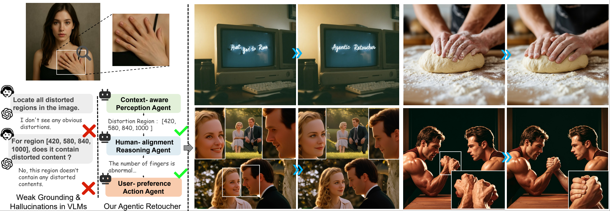
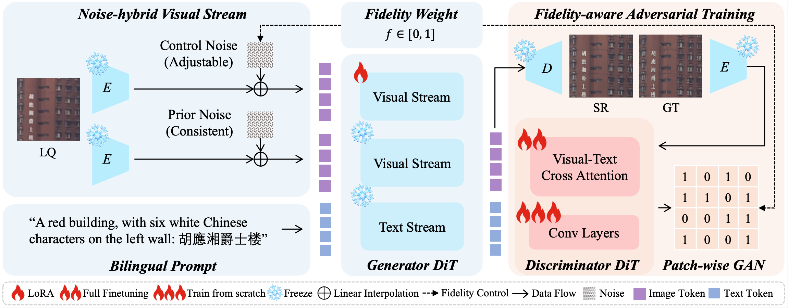
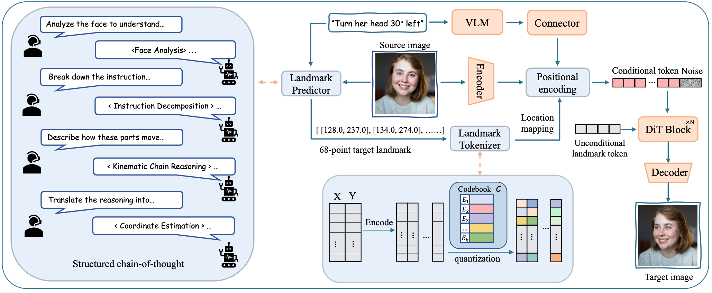
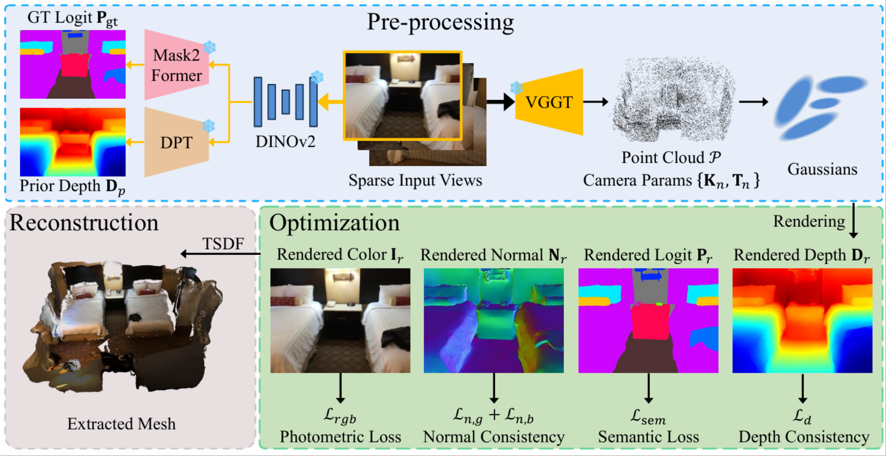
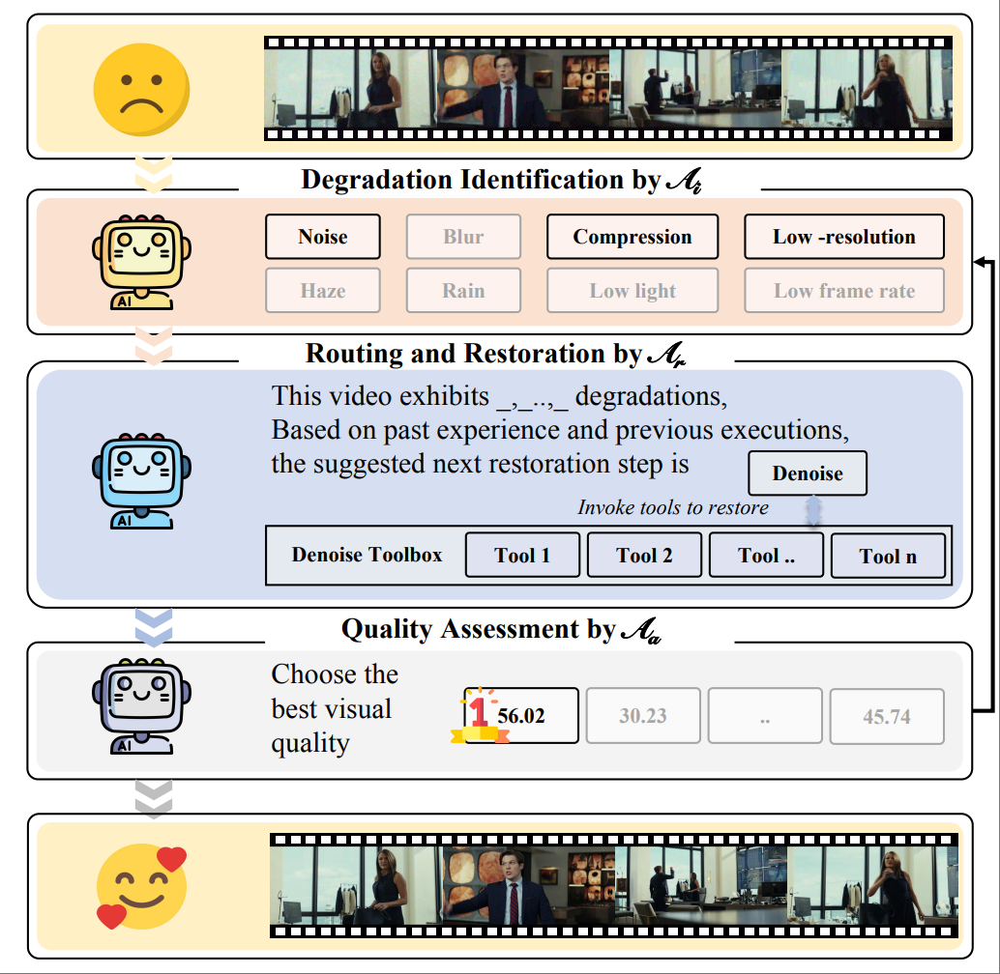
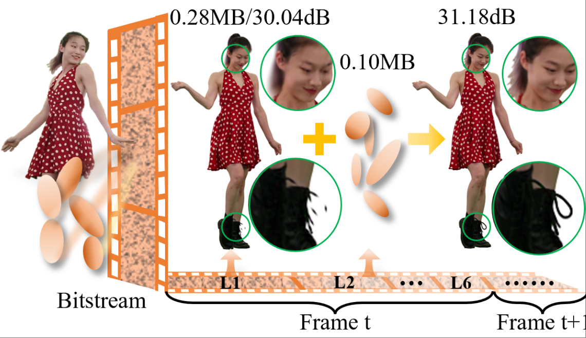

---
# Leave the homepage title empty to use the site title
title:
date: 2022-10-24
type: landing

sections:
  - block: contact
    content:

      text: |-

        <head>
          <meta charset="UTF-8" />
          <meta name="viewport" content="width=device-width, initial-scale=1.0"/>
          
        </head>
        <body>

          <h1><strong>欢迎来到上海交通大学智能媒体组 （MediaX@SJTU）</strong></h1>

          

            <strong>MediaX</strong> 隶属于 <a href="https://cmic.sjtu.edu.cn/CN/Default.aspx">上海交通大学未来媒体网络协同创新中心</a>，
            专注于 计算机视觉、机器学习 与 生成式智能媒体 交叉领域的前沿研究。
            我们致力于推动多模态媒体（2D/3D/4D）在生成、修复与增强、重建与压缩、以及质量评价等方向的发展。
            我们的使命是构建能够理解、建模和操控复杂人类中心视觉内容的智能系统，
            以实现高质量、高效率的下一代智能媒体内容生产。
          

          <h2>🎯 研究方向</h2>
          

            <strong>媒体感知与质量评价</strong> 
            构建面向UGC、PGC和AIGC内容的多维度智能质量评价体系。（<a href="https://arxiv.org/abs/2412.13155">F-Bench</a>、<a href="https://arxiv.org/pdf/2412.19238">FineVQ</a>等）
          

          

            <strong>视频修复与生成</strong> 
            高质量视频增强、可控生成与编辑，支持4K/8K分辨率。（<a href="https://arxiv.org/abs/2511.17138">ODTSR</a>、<a href="https://arxiv.org/abs/2509.25731">LaTo</a>、<a href="https://arxiv.org/abs/2306.00973">StoryGen</a>、<a href="https://arxiv.org/abs/2303.06885">Dr2</a>等）
          

          

            <strong>3D/4D重建与生成</strong> 
            基于3D高斯建模与生成式AI，实现沉浸式动态场景的高效表示与压缩。（<a href="https://arxiv.org/abs/2509.17513">4DGCPro</a>、<a href="https://arxiv.org/pdf/2503.18421">4DGC</a>、<a href="https://qianghu-huber.github.io/qianghuhomepage/paper/JSAC.pdf">VARFVV</a>等）
          

          

            <strong>智能媒体创作平台</strong> 
            构建协同、多智能体驱动的自动化与交互式媒体生产系统。(央视4K/8K超高清媒体智能增强制作平台、<a href="https://arxiv.org/abs/2510.08508">MoA-VR</a>、<a href="https://arxiv.org/abs/2601.02046">Agentic Retoucher</a>)
          

          <h2>📢 加入我们</h2>
          

            我们长期欢迎 <strong>博士研究生、硕士研究生、本科科研助理</strong> 加入团队。 
            如果你对智能媒体与生成式AI充满热情，欢迎将 <strong>个人简历与成绩单</strong> 发送至：
            <em>mediax@sjtu.edu.cn</em>
          

          <a href="mailto:mediax@sjtu.edu.cn" target="_blank">
          <i class="fas fa-envelope"></i> 联系我们
          </a>

          <a href="https://github.com/MediaX-SJTU" target="_blank">
              <i class="fab fa-github"></i> GitHub
          </a>

          <a href="https://notes.sjtu.edu.cn/s/9NKUMusdX" target="_blank">
              <i class="fab fa-weixin"></i> 微信
          </a>
        </body>

    design:
        columns: '1'

  - block: contact
    content:

      text: |-

        <html lang="en">
        <head>
            <meta charset="UTF-8">
            <meta name="viewport" content="width=device-width, initial-scale=1.0">
            <title>News</title>
            
        </head>
        <body>
            

                

                    <h1>🔥 News: </h1>
                

                

                    
[2025/2]   Two papers are accepted to CVPR

                    
[2026/1]   One paper is accepted to ICLR

                    
[2025/12]   Cover Paper in IEEE JSTSP

                    
[2025/12]   IEEE VCIP Best Paper Award

                    
[2025/12]   Runner-up, SIGGRAPH Asia 2025 Volumetric Video Challenge (Compression Track)

                    
[2025/11]   One paper is accepted to TCSVT

                    
[2025/10]   One paper is accepted to TPAMI

                    
[2025/10]   One paper is accepted to JSTSP

                    
[2025/9]   First Prize, Intelligent Restoration and Enhancement Track, 4th Broadcast and Online Audio-Visual Artificial Intelligence Application Innovation Competition

                    
[2025/9]   Two papers are accepted to NeurIPS 2025

                    
[2025/9]   MediaX团队超高清AI修复技术助力抗战胜利80周年晚会

                    
[2025/8]   Second Place, ICCV 2025 MIPI Challenge – Detailed Image Quality Assessment

                    
[2025/7]   Second Place, ICCV 2025 VQualA Challenge – GenAI-Bench AIGC Video Quality Assessment

                    
[2025/7]   Two papers are accepted to ACM MM 2025

                    
[2025/6]   Two papers are accepted to ICCV 2025

                    
[2025/5]   One paper is accepted to ICML 2025

                    
[2025/3]   Two papers are accepted to ICME 2025

                    
[2025/2]   Two papers are accepted to CVPR 2025

                    
[2025/2]   NTIRE 2025 XGC Quality Assessment Challenge Organizer

                    
[2025/1]   One paper is accepted to JSAC 2025

                    
[2024/12]  One paper is accepted to AAAI 2025

                    
[2024/7]   One paper is accepted to TCSVT 2024

                    
[2024/7]   One paper is accepted to ACM MM 2024

                    
[2024/6]   One paper is accepted to ICIP 2024

                

            

        </body>
        </html>
      
    design:
        columns: '1'

  - block: contact
    content:
      title: Publications
      text: |-

        

        <table class="paper-table">
          <tr>
            <!-- 左侧：图片单元格（固定宽度400px） -->
            <td>
              
 <!-- 灰色边框+白色底色的方框 -->
                
              

            </td>
            <!-- 右侧：论文信息单元格（自适应剩余宽度） -->
            <td>
              <h1 style="font-size: 27px; font-weight: bold; color: #2c3e50; margin-bottom: 15px; line-height: 1.3;">
                [CVPR'2026] Agentic Retoucher for Text-To-Image Generation
              </h1>
              

                Shaocheng Shen, Jianfeng Liang, Chunlei Cai, Cong Geng, Huiyu Duan, Xiaoyun Zhang, Qiang Hu, Guangtao Zhai
              

              

                IEEE/CVF Conference on Computer Vision and Pattern Recognition (CVPR), 2026.
              

              

                <a href="https://arxiv.org/abs/2601.02046" target="_blank" rel="noopener noreferrer" class="paper-link">[Paper]</a>
                <a href="https://github.com/MediaX-SJTU/Agentic-Retoucher" target="_blank" rel="noopener noreferrer" class="paper-link">[Code]</a>
              

            </td>
          </tr>
        </table>

        <table class="paper-table">
          <tr>
            <!-- 左侧：图片单元格（固定宽度400px） -->
            <td>
              
 <!-- 灰色边框+白色底色的方框 -->
                
              

            </td>
            <!-- 右侧：论文信息单元格（自适应剩余宽度） -->
            <td>
              <h1 style="font-size: 27px; font-weight: bold; color: #2c3e50; margin-bottom: 15px; line-height: 1.3;">
                [CVPR'2026] One-Step Diffusion Transformer for Controllable Real-World Image Super-Resolution
              </h1>
              

                Yushun Fang, Yuxiang Chen, Shibo Yin, Qiang Hu, Jiangchao Yao, Ya Zhang, Xiaoyun Zhang, Yanfeng Wang
              

              

                IEEE/CVF Conference on Computer Vision and Pattern Recognition (CVPR), 2026.
              

              

                <a href="https://arxiv.org/abs/2511.17138" target="_blank" rel="noopener noreferrer" class="paper-link">[Paper]</a>
                <a href="https://github.com/MediaX-SJTU/ODTSR" target="_blank" rel="noopener noreferrer" class="paper-link">[Code]</a>
              

            </td>
          </tr>
        </table>

        <table class="paper-table">
          <tr>
            <!-- 左侧：图片单元格（固定宽度400px） -->
            <td>
              
 <!-- 灰色边框+白色底色的方框 -->
                
              

            </td>
            <!-- 右侧：论文信息单元格（自适应剩余宽度） -->
            <td>
              <h1 style="font-size: 27px; font-weight: bold; color: #2c3e50; margin-bottom: 15px; line-height: 1.3;">
                [ICLR'2026] LaTo: Landmark-tokenized Diffusion Transformer for Fine-grained Human Face Editing
              </h1>
              

                Zhenghao Zhang, Ziying Zhang, Junchao Liao, Xiangyu Meng, Qiang Hu, Siyu Zhu, Xiaoyun Zhang, Long Qin, Weizhi Wang
              

              

                International Conference on Learning Representations (ICLR), 2026.
              

              

                <a href="https://arxiv.org/abs/2509.25731" target="_blank" rel="noopener noreferrer" class="paper-link">[Paper]</a>
                <a href="https://github.com/MediaX-SJTU/landmark-tokenized-dit" target="_blank" rel="noopener noreferrer" class="paper-link">[Code]</a>
              

            </td>
          </tr>
        </table>

        <table class="paper-table">
          <tr>
            <!-- 左侧：图片单元格（固定宽度400px） -->
            <td>
              
 <!-- 灰色边框+白色底色的方框 -->
                
              

            </td>
            <!-- 右侧：论文信息单元格（自适应剩余宽度） -->
            <td>
              <h1 style="font-size: 27px; font-weight: bold; color: #2c3e50; margin-bottom: 15px; line-height: 1.3;">
                [VCIP'2025] AlignGS: Aligning Geometry and Semantics for Robust Indoor Reconstruction from Sparse Views (Best Paper Award).
              </h1>
              

                Yijie Gao, Houqiang Zhong, Tianchi Zhu, Zhengxue Cheng, Qiang Hu, Li Song
              

              

                IEEE Visual Communications and Image Processing (VCIP) 2025.
              

              

                <a href="https://arxiv.org/pdf/2510.07839" target="_blank" rel="noopener noreferrer" class="paper-link">[Paper]</a>
                <a href="https://github.com/MediaX-SJTU/AlignGS" target="_blank" rel="noopener noreferrer" class="paper-link">[Code]</a>
              

            </td>
          </tr>
        </table>

        <table class="paper-table">
          <tr>
            <!-- 左侧：图片单元格（固定宽度400px） -->
            <td>
              
 <!-- 灰色边框+白色底色的方框 -->
                
              

            </td>
            <!-- 右侧：论文信息单元格（自适应剩余宽度） -->
            <td>
              <h1 style="font-size: 27px; font-weight: bold; color: #2c3e50; margin-bottom: 15px; line-height: 1.3;">
                [JSTSP'2025] MoA-VR: A Mixture-of-Agents System Towards All-in-One Video Restoration
              </h1>
              

                Lu Liu, Chunlei Cai, Shaocheng Shen, Jianfeng Liang, Weimin Ouyang, Tianxiao Ye, Jian Mao, Huiyu Duan, Jiangchao Yao, Xiaoyun Zhang, Qiang Hu, Guangtao Zhai
              

              

                IEEE Journal of Selected Topics in Signal Processing (JSTSP), 2025.
              

              

                <a href="https://arxiv.org/abs/2510.08508" target="_blank" rel="noopener noreferrer" class="paper-link">[Paper]</a>
              

            </td>
          </tr>
        </table>

        <table class="paper-table">
          <tr>
            <!-- 左侧：图片单元格（固定宽度400px） -->
            <td>
              
 <!-- 灰色边框+白色底色的方框 -->
                
              

            </td>
            <!-- 右侧：论文信息单元格（自适应剩余宽度） -->
            <td>
              <h1 style="font-size: 27px; font-weight: bold; color: #2c3e50; margin-bottom: 15px; line-height: 1.3;">
                [NeurIPS'2025] 4DGCPro: Efficient Hierarchical 4D Gaussian Compression for Progressive Volumetric Video Streaming
              </h1>
              

                Zihan Zheng, Zhenlong Wu, Houqiang Zhong, Yuan Tian, Ning Cao, Lan Xu, Jiangchao Yao, Xiaoyun Zhang, Qiang Hu, Wenjun Zhang
              

              

                The Thirty-Ninth Annual Conference on Neural Information Processing Systems (NeurIPS), 2025.
              

              

                <a href="https://arxiv.org/abs/2509.17513" target="_blank" rel="noopener noreferrer" class="paper-link">[Paper]</a>
              

            </td>
          </tr>
        </table>

        <!-- 表格布局：左右两栏 -->
        <table class="paper-table">
          <tr>
            <!-- 左侧：图片单元格（固定宽度400px） -->
            <td>
              
 <!-- 灰色边框+白色底色的方框 -->
                
              

            </td>
            <!-- 右侧：论文信息单元格（自适应剩余宽度） -->
            <td>
              <h1 style="font-size: 27px; font-weight: bold; color: #2c3e50; margin-bottom: 15px; line-height: 1.3;">
                [ICCV'2025] F-Bench: Rethinking Human Preference Evaluation Metrics for Benchmarking Face Generation, Customization, and Restoration
              </h1>
              

                Lu Liu, Huiyu Duan, Qiang Hu, Liu Yang, Chunlei Cai, Tianxiao Ye, Huayu Liu, Xiaoyun Zhang, Guangtao Zhai
              

              

                IEEE/CVF International Conference on Computer Vision (ICCV), 2025.
              

              

                <a href="https://arxiv.org/abs/2412.13155" target="_blank" rel="noopener noreferrer" class="paper-link">[Paper]</a>
              

            </td>
          </tr>
        </table>

        <table class="paper-table">
          <tr>
            <!-- 左侧：图片单元格（固定宽度400px） -->
            <td>
              
 <!-- 灰色边框+白色底色的方框 -->
                
              

            </td>
            <!-- 右侧：论文信息单元格（自适应剩余宽度） -->
            <td>
              <h1 style="font-size: 27px; font-weight: bold; color: #2c3e50; margin-bottom: 15px; line-height: 1.3;">
                [CVPR'2025]4DGC: Rate-Aware 4D Gaussian Compression for Efficient Streamable Free-Viewpoint Video
              </h1>
              

                Qiang Hu, Zihan Zheng, Houqiang Zhong, Sihua Fu, Li Song, Xiaoyun Zhang, Guangtao Zhai, Yanfeng Wang.
              

              

                IEEE/CVF Conference on Computer Vision and Pattern Recognition (CVPR), 2025.
              

              

                <a href="https://arxiv.org/pdf/2412.19238" target="_blank" rel="noopener noreferrer" class="paper-link">[Paper]</a>
                <a href="https://github.com/qianghu-huber/4DGC" target="_blank" rel="noopener noreferrer" class="paper-link">[Code]</a>
              

            </td>
          </tr>
        </table>

        <!-- 表格布局：左右两栏 -->
        <table class="paper-table">
          <tr>
            <!-- 左侧：图片单元格（固定宽度400px） -->
            <td>
              
 <!-- 灰色边框+白色底色的方框 -->
                
              

            </td>
            <!-- 右侧：论文信息单元格（自适应剩余宽度） -->
            <td>
              <h1 style="font-size: 27px; font-weight: bold; color: #2c3e50; margin-bottom: 15px; line-height: 1.3;">
                [CVPR'2025] FineVQ: Fine-Grained User Generated Content Video Quality Assessment
              </h1>
              

                Huiyu Duan, Qiang Hu, Wang Jiarui, Liu Yang, Zitong Xu, Lu Liu, Xiongkuo Min, Chunlei Cai, Tianxiao Ye, Xiaoyun Zhang, Guangtao Zhai
              

              

                IEEE Conference on Computer Vision and Pattern Recognition (CVPR), 2025.
              

              

                <a href="https://arxiv.org/pdf/2503.18421" target="_blank" rel="noopener noreferrer" class="paper-link">[Paper]</a>
                <a href="https://github.com/qianghu-huber/4DGC" target="_blank" rel="noopener noreferrer" class="paper-link">[Code]</a>
              

            </td>
          </tr>
        </table>

        <table class="paper-table">
          <tr>
            <!-- 左侧：图片单元格（固定宽度400px） -->
            <td>
              
 <!-- 灰色边框+白色底色的方框 -->
                
              

            </td>
            <!-- 右侧：论文信息单元格（自适应剩余宽度） -->
            <td>
              <h1 style="font-size: 27px; font-weight: bold; color: #2c3e50; margin-bottom: 15px; line-height: 1.3;">
                [JSAC'2025]VARFVV: View-Adaptive Real-Time Interactive Free-View Video Streaming with Edge Computing
              </h1>
              

                Qiang Hu, Qihan He, Houqiang Zhong, GuoLu, Xiaoyun Zhang,Guangtao Zhai,Yanfeng Wang
              

              

                IEEE Journal on Selected Areas in Communications (JSAC), 2025.
              

              

                <a href="https://qianghu-huber.github.io/qianghuhomepage/paper/JSAC.pdf" target="_blank" rel="noopener noreferrer" class="paper-link">[Paper]</a>
                <a href="https://waveviewer.github.io/" target="_blank" rel="noopener noreferrer" class="paper-link">[Code]</a>
              

            </td>
          </tr>
        </table>
        
        <table class="paper-table">
          <tr>
            <!-- 左侧：图片单元格（固定宽度400px） -->
            <td>
              
 <!-- 灰色边框+白色底色的方框 -->
                
              

            </td>
            <!-- 右侧：论文信息单元格（自适应剩余宽度） -->
            <td>
              <h1 style="font-size: 27px; font-weight: bold; color: #2c3e50; margin-bottom: 15px; line-height: 1.3;">
                [AAAI'2025] VRVVC: Variable-Rate NeRF-Based Volumetric Video Compression
              </h1>
              

                Qiang Hu,Houqiang Zhong,Zihan Zheng,Xiaoyun Zhang,Zhengxue Cheng,Li Song,Guangtao Zhai,Yanfeng Wang
              

              

                The Association for the Advancement of Artificial Intelligence (AAAI), 2025.
              

              

                <a href="https://qianghu-huber.github.io/qianghuhomepage/paper/AAAI_VRVVC_CameraReady.pdf" target="_blank" rel="noopener noreferrer" class="paper-link">[Paper]</a>
              

            </td>
          </tr>
        </table>
        
        <table class="paper-table">
          <tr>
            <!-- 左侧：图片单元格（固定宽度400px） -->
            <td>
              
 <!-- 灰色边框+白色底色的方框 -->
                
              

            </td>
            <!-- 右侧：论文信息单元格（自适应剩余宽度） -->
            <td>
              <h1 style="font-size: 27px; font-weight: bold; color: #2c3e50; margin-bottom: 15px; line-height: 1.3;">
                [MM'2024] HPC: Hierarchical Progressive Coding Framework for Volumetric Video
              </h1>
              

                Zihan Zheng, Houqiang Zhong, Qiang Hu, Xiaoyun Zhang, Li Song, Ya Zhang, Yanfeng Wang
              

              

                Proceedings of the ACM International Conference on Multimedia(MM), 2024.
              

              

                <a href="https://arxiv.org/abs/2407.09026" target="_blank" rel="noopener noreferrer" class="paper-link">[Paper]</a>
              

            </td>
          </tr>
        </table>
        
        <table class="paper-table">
          <tr>
            <!-- 左侧：图片单元格（固定宽度400px） -->
            <td>
              
 <!-- 灰色边框+白色底色的方框 -->
                
              

            </td>
            <!-- 右侧：论文信息单元格（自适应剩余宽度） -->
            <td>
              <h1 style="font-size: 27px; font-weight: bold; color: #2c3e50; margin-bottom: 15px; line-height: 1.3;">
                [CVPR'2024] Intelligent Grimm - Open-ended Visual Storytelling via Latent Diffusion Models
              </h1>
              

                Chang Liu, Haoning Wu, Yujie Zhong, Xiaoyun Zhang, Yanfeng Wang, Weidi Xie
              

              

                IEEE Conference on Computer Vision and Pattern Recognition (CVPR), 2024.
              

              

                <a href="https://arxiv.org/abs/2306.00973" target="_blank" rel="noopener noreferrer" class="paper-link">[Paper]</a>
                <a href="https://github.com/haoningwu3639/StoryGen" target="_blank" rel="noopener noreferrer" class="paper-link">[Code]</a>
              

            </td>
          </tr>
        </table>

        <a href="https://cabbgedog.github.io/MediaX_pre/publication/" class="bottom-link" target="_blank" rel="noopener noreferrer">More on publication page</a>
    design:
        columns: '1'

        

  - block: markdown
    content:
      title:
      subtitle:
      text: |
        {}
    design:
      columns: '1'
---