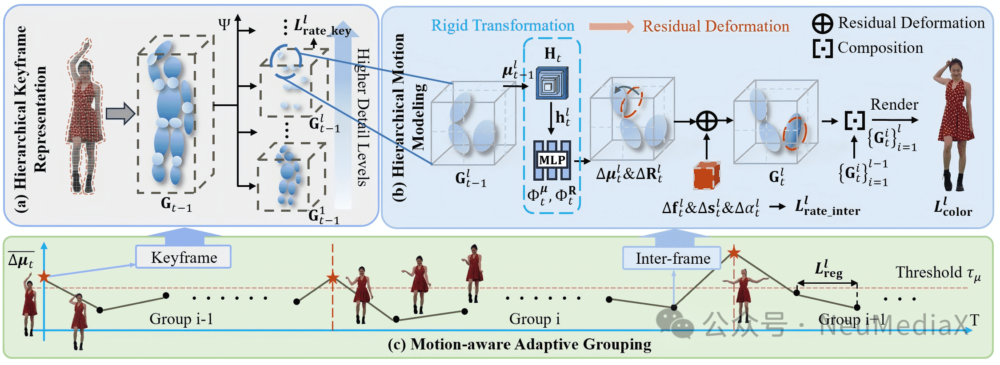
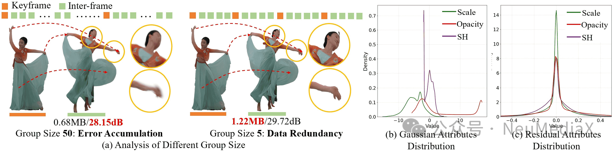
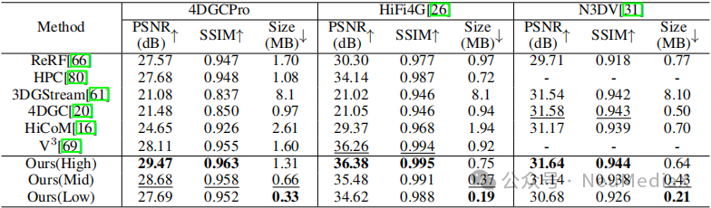
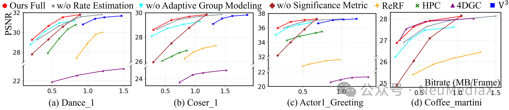
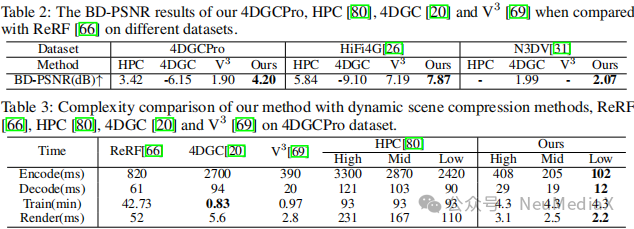
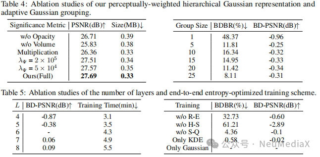

---
title: NeurlPS 2025 | 4DGCPro：面向渐进式体积视频流的高效分层4D高斯压缩技术
date: 2025-09-25
type: landing

sections:
  - block: contact
    content:

      text: |-
        # NeurlPS 2025 | 4DGCPro：面向渐进式体积视频流的高效分层4D高斯压缩技术

        近年来，体积视频（Volumetric Video）作为沉浸式媒体的重要形式，逐渐成为虚拟现实、增强现实及未来互联网应用的关键内容载体。然而，与传统二维视频相比，体积视频在存储、传输带宽与实时渲染等方面仍面临显著挑战，尤其在网络条件不稳定的移动端设备上，这一问题更为突出。针对现有方法存在单一模型多码率支持不足、实时解码性能有限以及复杂运动场景鲁棒性不佳等问题，上海交通大学、上海AI Lab、上海科技大学等单位的研究团队联合天翼视讯科技有限公司提出了一种新的压缩框架——4DGCPro，首次在动态高斯表征单一模型中实现了多码率支持，并能在手机等轻量级设备上完成实时解码与高保真渲染。

        
        
        论文链接: `https://arxiv.org/abs/2509.17513`

        项目地址: `https://mediax-sjtu.github.io/4DGCPro/`

        ## 关键技术
         
        4DGCPro 的核心目标是实现单一模型支持多比特率的渐进式体积视频流，并保证在轻量级设备上的实时解码与高保真渲染。论文的关键技术主要有三点：
        - 分层式四维高斯表示：提出基于体积与不透明度的感知加权指标，对高斯点进行分层排序。通过逐层传输与渲染，用户可根据网络带宽与算力动态选择解码层数，实现渐进式增强的视觉效果。
         
        - 分层运动建模与自适应分组：将帧间运动分解为刚性变换与残差形变，提升大幅动作场景下的稳定性。引入“运动感知分组”机制，根据场景运动强度自适应调整分组长度，在保证压缩率的同时减少误差累积。
        - 端到端熵优化训练与渐进式码流生成：针对不同高斯属性构建不同构造的熵模型，并引入分层率失真监督，提高压缩效率。最终将高斯参数展平为二维图像并利用标准视频编码器压缩，实现与现有硬件解码器的兼容。

        目前，该成果已被机器学习顶级会议 NeurlPS 2025 正式接收。

        ## 实验结果

        作者在 N3DV、HiFi4G 和自建 4DGCPro 数据集 上进行了全面实验，对比了 ReRF、HPC、3DGStream、4DGC、HiCoM、V3 等方法。
        
        
        
        
        
        - 视觉效果：4DGCPro 在复杂动作和长序列下保持更清晰、更稳定。
        - 定量指标：在 PSNR、SSIM 上全面领先，同等质量下模型更小；比 HPC 压缩率高 3 倍。
        - 效率测试：标准质量下解码<20ms/帧，渲染<3ms/帧，桌面端可达 50FPS，移动端也能实时播放。
        - 消融实验：验证了分层表示、自适应分组、熵优化训练等设计的有效性。

        由此可见，4DGCPro 同时实现了高质量、低码率和实时解码渲染，首次让体积视频的“渐进式流媒体”在移动端成为可能。

---