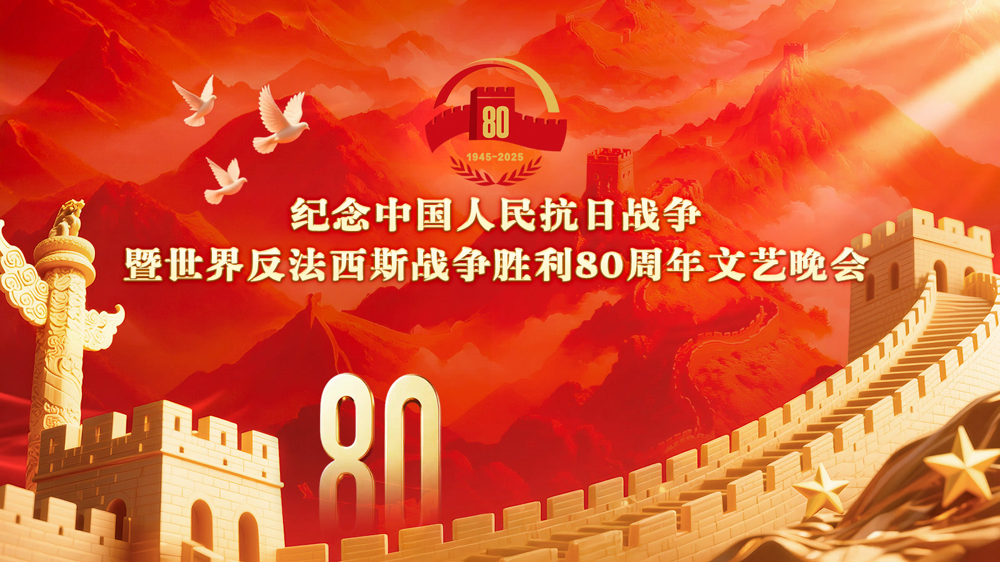
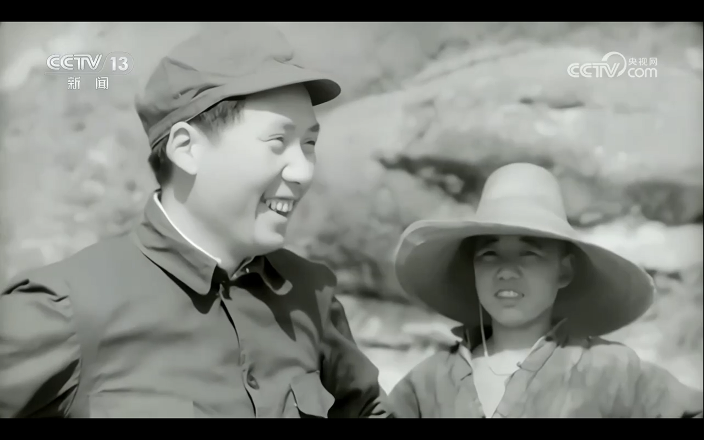
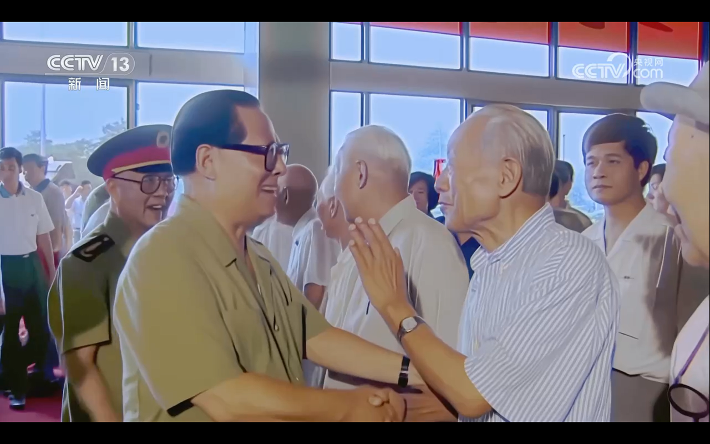
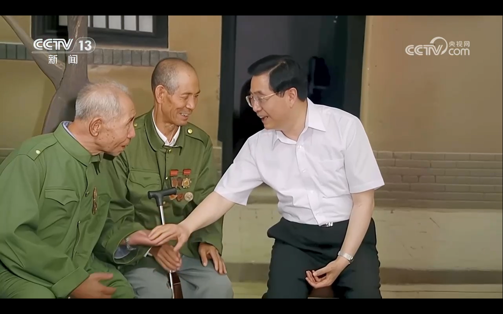
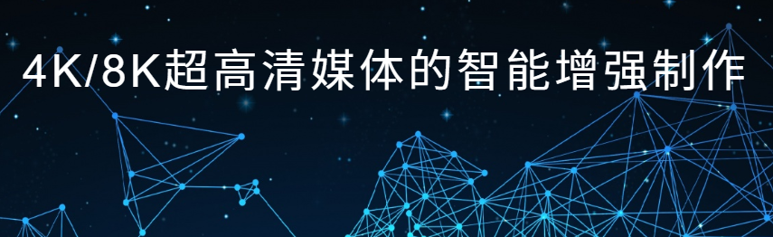
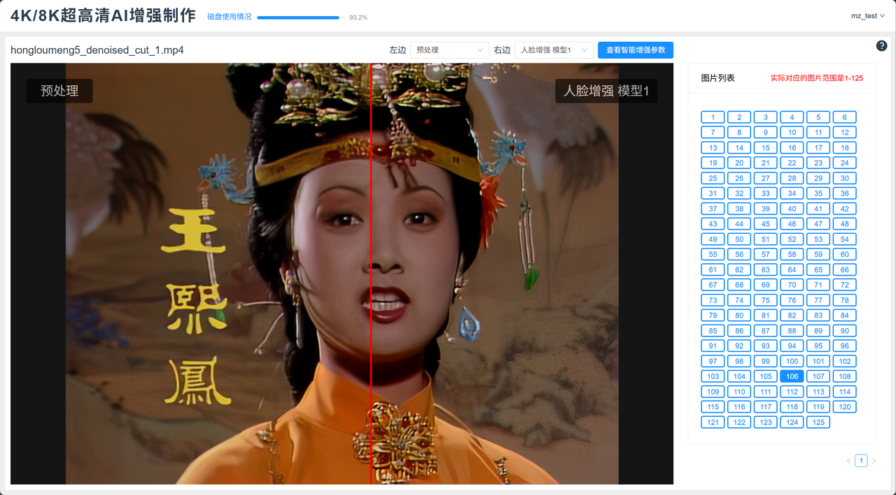
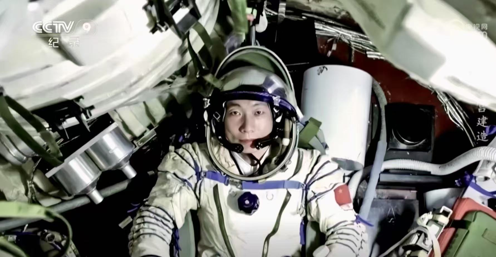
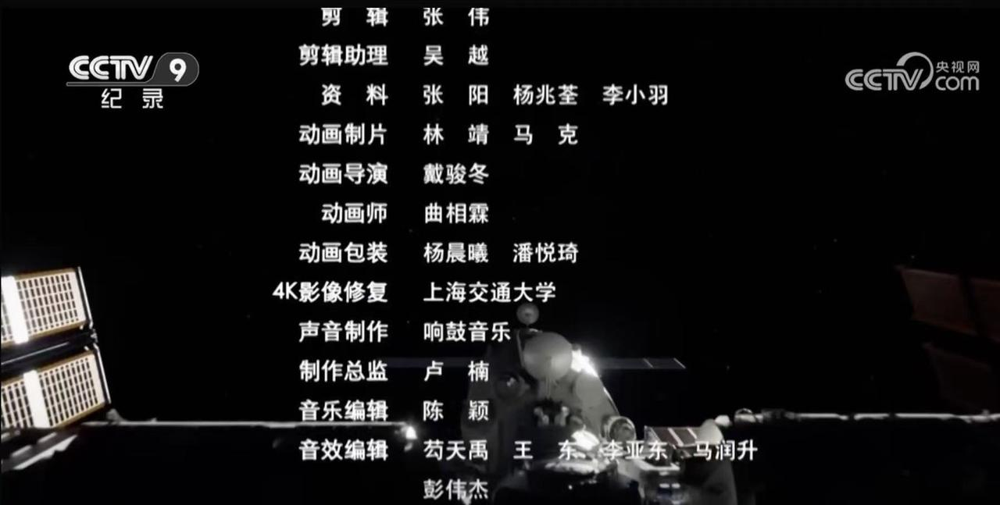

---
title: AI赋能历史影像修复：上交大团队超高清AI修复技术助力抗战胜利80周年晚会
date: 2025-09-10
type: landing

sections:
  - block: contact
    content:

      text: |-
        # AI赋能历史影像修复：上交大团队超高清AI修复技术助力抗战胜利80周年晚会
        

        在人工智能赋能文化遗产保护的进程中，超高清影像修复技术正在为珍贵历史资料的传承注入新活力。上海交通大学未来媒体网络协同创新中心（CMIC）智能媒体研究组（MediaX），依托在智能媒体领域的长期研究积累，并与中央广播电视总台上海总站、超高清视音频制播呈现国家重点实验室紧密合作，完成了对不同时期我国领导人珍贵历史影像的4K/8K超高清修复与增强工作。相关修复影像已在纪念中国人民抗日战争暨世界反法西斯战争胜利80周年文艺晚会中播出。本次修复将生成式与判别式技术相结合，有效提升了影像的清晰度与细节表现，使这份承载特殊历史记忆的资料在新时代舞台重焕光彩。

        ## 生成与判别AI协同的超高清修复增强
        

        抗战胜利文艺晚会现场大屏影像记录了重要的历史时刻，具有不可替代的价值。但受限于当时的存储条件与技术水平，这些影像随时间推移出现了画面模糊、色彩偏差、噪声干扰等问题，影响了其呈现效果与传播价值。传统修复方法多依赖人工干预，不仅耗时费力，修复效果也易受主观因素影响；而单一技术路径在应对复杂退化情况时，也难以兼顾修复效率与画面质量。面对这一挑战，团队结合自身在 AI 视觉技术领域的研究经验，采用生成式与判别式融合的技术思路，为影像修复提供了新的解决方案。
        

        在本次珍贵历史影像的修复中，生成式人工智能发挥了“无中生有”的神奇力量。它通过学习大量高质量图像数据，理解图像结构和特征，对受损或模糊部分进行智能推测和修复，使模糊的面部轮廓清晰，衣着纹理更加完整。修复后的珍贵历史影像在人民大会堂大礼堂屏幕上展示时，画面清晰、细节丰富，将那个时代的精神风貌与厚重质感生动呈现，带来身临其境的震撼感与跨越时空的共鸣。
        

        而判别式技术在此过程中，扮演的是 “原始影像的忠实守护者”—— 其核心作用是保障修复结果的保真度，确保生成式技术的 “补全” 不偏离原视频本貌。团队利用判别式模型能力，从 “细节特征” 到 “整体场景” 双重保障修复结果对原始影像的还原度。通过这种方式，修复后的影像在细节、色彩和整体视觉效果上都更加逼真，最大限度地还原了历史的真实场景。

        ## 一站式智能修复增强平台
        

        团队自主研发的4K/8K 超高清媒体智能增强制作平台，集成了多项自主创新的前沿视频修复技术，包括图像识别、智能降噪、超分辨率、视频插帧以及生成式人脸修复等，并采用生成式与判别式融合方法，实现了视频修复与增强的智能化升级。
        
        
        基于自主研发的AI视频增强平台，团队已完成中央广播电视总台300余段珍贵影像的超高清增强，涵盖庆祝建党百年七一庆典演出《伟大征程》、历届冬奥会开幕式集锦等历史素材，央视版《红楼梦》《西游记》等四大名著，《舌尖上的中国》《天宫建造》等纪录片，《闪闪的红星》《洪湖赤卫队》等经典影视剧，以及《千秋诗颂》等AIGC内容。
        

        

        未来，随着前沿技术的不断迭代，更多珍贵历史影像将焕发新生，为红色文化的数字化传承提供坚实支撑。科研团队将持续攻克关键技术难题，推动自主音视频处理技术的产业化落地，为国家重大活动提供有力技术保障，助力中国声音与影像在世界舞台上精彩呈现。

---