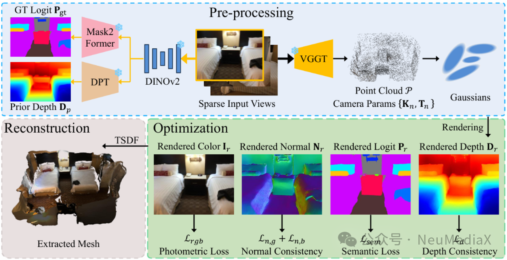
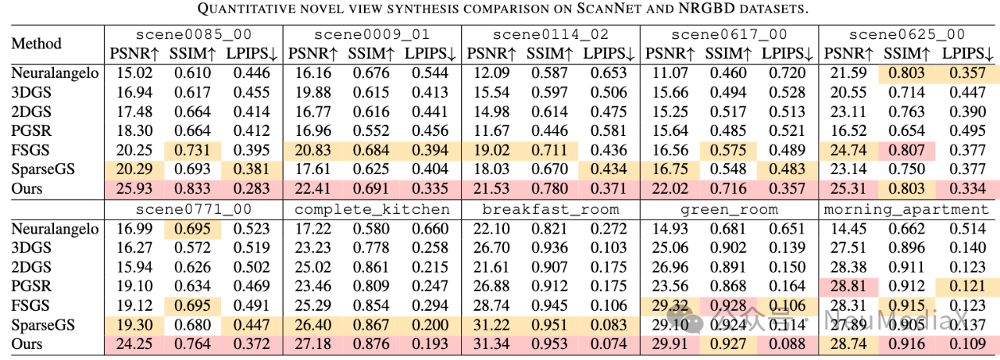
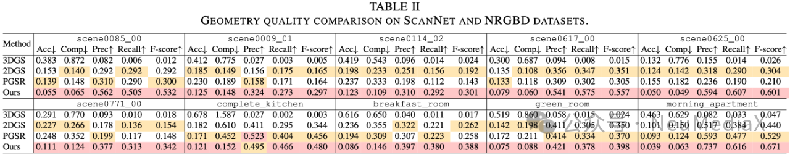
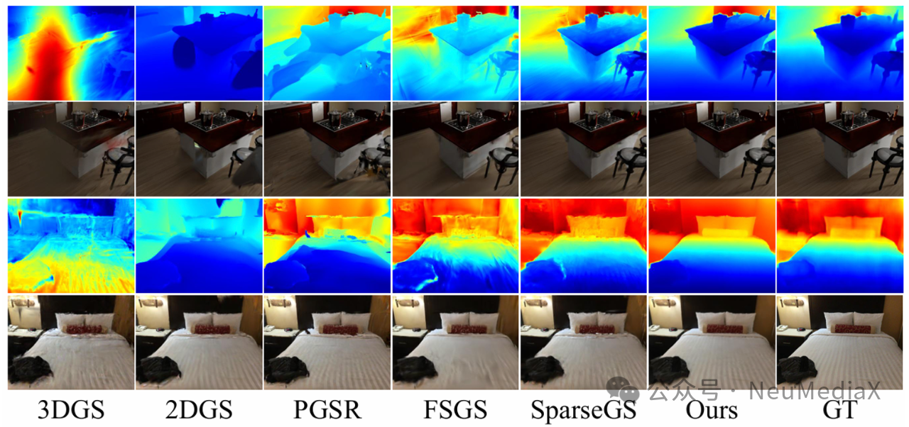
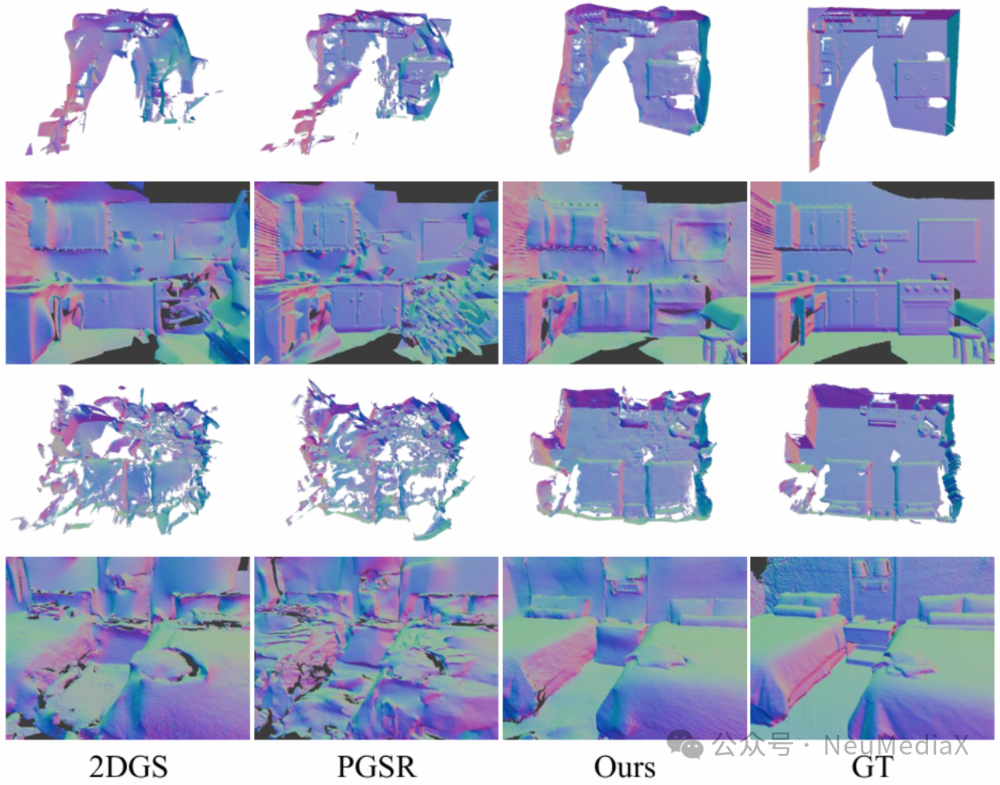
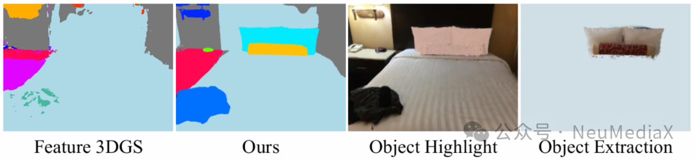

---
title: VCIP 2025 Best Paper｜AlignGS 语义与几何协同的稀疏视角室内3D重建方法
date: 2025-10-26
type: landing

sections:
  - block: contact
    content:

      text: |-
        # VCIP 2025 | AlignGS：对齐几何与语义的稀疏视角鲁棒室内重建框架

        **论文题目**：AlignGS: Aligning Geometry and Semantics for Robust Indoor Reconstruction from Sparse Views  
        **作者**：Yijie Gao *，Houqiang Zhong *，Tianchi Zhu，Zhengxue Cheng，Qiang Hu †，Li Song †  
        **来源**：IEEE Visual Communications and Image Processing (VCIP) 2025  
        **论文地址**：`https://arxiv.org/abs/2510.07839`  
        **开源代码**：`https://github.com/MediaX-SJTU/AlignGS`

        随着增强现实（AR）、虚拟现实（VR）与机器人技术的快速发展，对**高质量且富含语义信息的室内 3D 场景模型**需求急剧增长。然而，从**稀疏视角（Sparse Views）**的图像输入重建结构完整、语义一致的 3D 模型仍然非常困难：稀疏视角会加剧“视图—几何歧义”，在室内复杂布局与遮挡条件下，传统 SfM（Structure-from-Motion）管线常因特征匹配不足而失败，进而导致基于 3D Gaussian Splatting（3DGS）的重建出现几何畸变与视觉伪影。

        现有语义重建方法（如 Feature 3DGS、SAGA 等）通常遵循“**先几何，后语义**”范式：假设已有较完善的几何，再将语义特征投影/蒸馏到几何基元上。这在密集视角下可行，但在稀疏视角下会遭遇根本困境：**几何本身破碎或错误**，语义附着在缺陷几何上也难以连贯。

        AlignGS 的核心主张是：**语义不应是被动附着属性，而应成为主动的几何引导力量**。为此，本文提出 **AlignGS**，通过**几何与语义的端到端协同优化**，将 2D 视觉基础模型中的语义与几何先验“反向”用于规范（regularize）3D 表示，从而实现稀疏视角下的鲁棒室内重建。大量基准评估表明，AlignGS 在**新视角合成（NVS）**与**表面模型重建（Mesh Reconstruction）**任务上均取得 SOTA 性能。

        

        ---

        ## 方法概览

        AlignGS 提出一个端到端联合优化框架，主要由三个核心模块组成：  
        1) SfM-Free 的鲁棒初始化  
        2) 从 2D 到 3D 的端到端语义蒸馏  
        3) 语义引导的几何优化（深度一致性 + 多面法向一致性）

        ---

        ## 关键技术

        ### 1) SfM-Free 的鲁棒初始化

        针对传统 SfM 工具（如 COLMAP）在稀疏视角下易因特征匹配困难而失败的问题，AlignGS 集成了 **VGGT (Visual Geometry Grounded Transformer)**。该前馈网络能够仅凭稀疏输入图像，直接生成高质量的**初始点云**与**相机位姿**，从而跳过脆弱的 SfM 步骤，为后续 3D 高斯优化提供稳健的几何起点。

        ### 2) 从 2D 至 3D 的端到端语义蒸馏

        为赋予 3D 场景细粒度语义理解，AlignGS 为每个高斯基元额外增广一个可学习的 **150 维语义向量**。模型使用预训练的 **DINOv2 + Mask2Former** 作为“教师网络”，生成伪真值语义图；再通过 Alpha-blending 渲染得到 3D 语义特征图，并采用 **双重监督蒸馏（Dual-Supervision Distillation）**：

        - **软蒸馏（Soft Distillation）**：最小化 KL 散度，保留教师输出的概率分布信息，捕捉类别间细微关联。  
        - **硬蒸馏（Hard Distillation）**：对齐教师置信度最高的类别标签，确保最终语义分类的明确性与准确性。

        ### 3) 语义引导的几何优化（Semantic-Guided Geometric Optimization）

        该模块利用 2D 基础模型提供的语义与几何先验，主动约束 3D 高斯的生长方向与形状，从而修正稀疏视角导致的几何畸变。主要包含两类约束：

        #### 3.1 深度一致性约束（Depth Consistency）

        AlignGS 使用 DINOv2 + DPT 生成的单目深度先验来正则化渲染深度。考虑到单目深度固有的尺度模糊与边缘误差，方法采用 **Pearson 相关系数**构建尺度不变约束；同时引入 **语义边缘掩码（Semantic Edge Mask）**，在计算时剔除不可靠的物体边界区域，提升几何优化鲁棒性。

        #### 3.2 多面法向一致性（Multi-faceted Normal Consistency）

        为兼顾表面平滑性与语义边界处的锐利结构，AlignGS 设计了互补的法向约束：

        - **几何法向一致性**：约束高斯球显式朝向（由旋转参数决定的最短轴）与渲染深度梯度法向一致，减少噪点与伪影，保持表面连续平滑。  
        - **语义边界法向正则化**：基于“不同语义对象交界处法向应不连续”的直觉，识别跨语义边界的像素对，并最小化其法向余弦相似度，从而锐化物体间几何边缘，实现更清晰的结构分割。

        ---

        ## 实验设置

        **数据集**：真实世界 **ScanNet** 与合成 **NRGBD**。  
        为模拟极具挑战性的稀疏视角：  
        - ScanNet：每场景平均仅使用 **36** 张视图训练（总约 **1383** 张）  
        - NRGBD：每场景平均仅使用 **20** 张视图训练（总约 **1185** 张）  
        实验均在指定分辨率设置下进行。

        ---

        ## 对比结果

        ### 定量对比

        我们将 AlignGS 与 Neuralangelo、3DGS、2DGS、PGSR、FSGS、SparseGS 等方法进行对比，涵盖新视角合成与几何重建质量：

        - **新视角合成（NVS）**：在 PSNR、SSIM、LPIPS 上均取得 SOTA。  
          - ScanNet 的 `scene0085_00`：PSNR 达到 **25.93**  
          - NRGBD 的 `breakfast_room`：PSNR 达到 **31.34**  
          LPIPS 的优势也表明其在感知质量上更优。  

        

        - **几何重建质量**：生成 Mesh 在准确性与完整性上均明显提升。  
          - ScanNet 的 `scene0625_00`：F-score **0.601**，几乎是 2DGS（0.304）的两倍  
          - NRGBD 的 `morning_apartment`：F-score **0.671**  
          说明在稀疏输入下仍能保持卓越几何保真度。

        

        ### 定性对比与下游应用

        可视化结果显示，相比基线方法，AlignGS 重建的几何表面伪影显著减少；在墙面与物体等不同语义对象的交界处，边缘更锐利、结构更清晰。得益于精准的语义与几何场，AlignGS 还可支持高质量的下游语义应用，例如 3D 场景分割、特定对象（枕头、靠垫等）的提取/移除/高亮等编辑任务。

        
        
        

        ---

        ## 结论

        AlignGS 提出了一种面向稀疏视角室内重建的端到端新框架：不同于传统方法被动依赖几何，AlignGS 利用 2D 语义与几何先验作为正则项，直接引导 3D 高斯的几何优化。通过集成 Transformer 的 SfM-Free 初始化，并引入深度一致性与多面法向一致性等创新机制，实现了几何结构与语义理解的协同提升。实验结果表明，AlignGS 在稀疏视角条件下不仅能实现高质量新视角合成，还能重建更连贯、更合理的 3D 几何模型，为低成本、高保真的室内数字孪生构建提供了新思路。

---