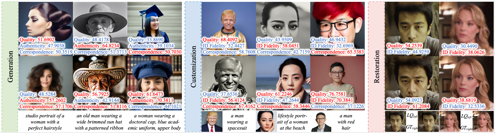
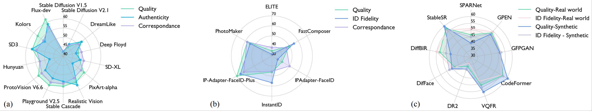
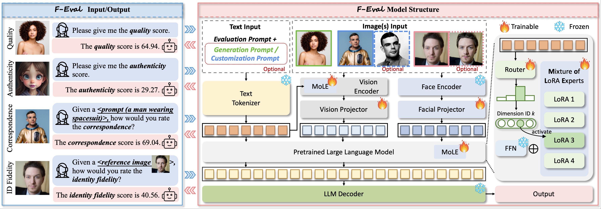
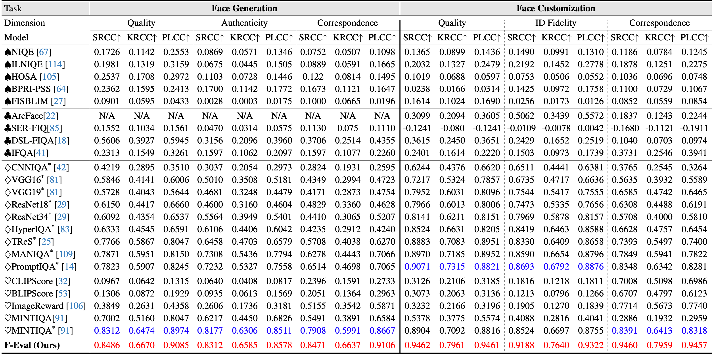
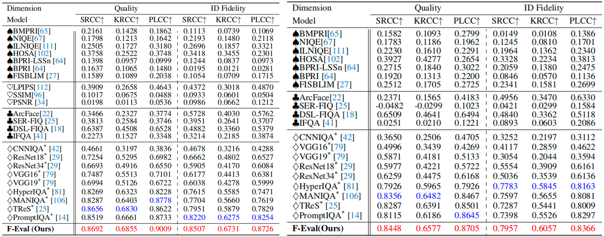

---
title: ICCV 2025 Highlight | F-bench：生成式人脸质量评估数据集与方法
date: 2025-09-15
type: landing

sections:
  - block: contact
    content:

      text: |-
        # ICCV 2025 Highlight | F-bench: 生成式人脸质量评估数据集与方法

        在短视频、虚拟人和AIGC全面爆发的今天，AI人脸生成技术已经广泛应用于虚拟形象、定制化内容、老照片修复、影视后期等场景。生成效果越来越逼真，带来了丰富的创作可能性。但与此同时，用户和创作者也常常遇到失真、伪影、不自然、甚至“AI感”过重的人脸图像。更棘手的是，这些瑕疵往往细微且主观：眼睛大小、肤质纹理、身份保持度……任何一点偏差都可能让观感大打折扣。然而，现有的图像质量评价方法大多停留在“整体打分”，缺乏对人脸生成的细粒度、贴近人类偏好的多维度评估。这让AI人脸生成的优化与落地始终缺乏科学的参照标准。 为此，上海交通大学联合bilibili公司推出了全球首个专注于AI人脸生成的细粒度质量评估数据库FaceQ，包含12,000+图像和491,000+多维度标注，全面对齐人类偏好。在此基础上，团队构建了人脸生成模型测评基准 F-Bench，系统评估现有模型在生成、定制、修复等任务下的优劣；并提出了基于大规模多模态模型的全维度评估方法F-Eval，为生成式人脸图像提供多维度质量评估。

        
        
        论文链接: `https://arxiv.org/abs/2412.13155`

        项目地址: `https://mediax-sjtu.github.io/F-Bench/`
        ## 核心亮点
        - 首创数据库：包含 12K+ 条生成式人脸图像，提供 491K+ 的多维度质量评分
        - 统一评测基准：跨29个模型，覆盖生成、定制、修复
        - 大一统模型：评估人脸质量、真实性、身份保持度、图文一致性等四个维度。

        目前，该成果已被机器学习顶级会议 ICCV 2025 正式接收，并入选Highlight。

        ## FaceQ：首个生成式人脸质量评价数据库

        为了科学、系统地评估生成式人脸图像，我们团队自主构建了 FaceQ 数据库。不同于以往依赖零散数据的方式，FaceQ 的 12K+ 张源图像全部由 29 种主流人脸生成模型在统一的设置下生成，覆盖了人脸生成、人脸编辑与人脸修复三大类任务。
        在严格控制的实验环境下，我们进一步组织了大规模主观实验，对这些图像进行主观打分，并从以下四个维度展开评价：
        1.质量（Quality）：待评估图像的感知质量；
        2.真实性（Authenticity）：待评估图像是否接近真实照片，是否有较强AI感；
        3.身份保持度（ID Fidelity）：给定参考图像，待评估图像是否保持了参考图像的身份特征；
        4.图文一致性（Correspondence）：待评估图像是否符合给定的文本输入。

        
        图 1: FaceQ数据集样例

        FaceQ共采集了491K+人类偏好标注与32K+ MOS分数。

        ## F-Bench：生成式人脸质量全方位评测
        在FaceQ数据库的基础上，研究团队进一步推出了面向人脸生成的多维度评测F-Bench。它以人类偏好分数为标准，覆盖了生成、编辑、修复三大类任务，囊括包括 Flux、Hunyuan 在内的29种主流模型。

        
        图 2: F-Bench中方法性能雷达图
        在分析方法上，F-Bench从三个层面展开：
        - 维度视角：对比不同任务下的质量、真实度、身份保持度和图文一致性，揭示模型在不同维度的共性与短板。
        - 模型视角：对29个代表性模型逐一分析，全面刻画各自的优势与不足，为未来优化提供方向。
        - 类别视角：结合不同类别的文本和图像提示词进行细分评测，揭示复杂场景（如表情、动作、细粒度属性）对模型能力的真实挑战。

        ## F-Eval：多维度生成式质量评价算法

        为了能同时分析人脸图像多个维度的质量，作者们提出了一种通用的人脸质量图像评估方法F-Eval，该方法可以支持对人脸质量、真实度、身份保持度和图文一致性进行评分。

        
        图 3: F-Eval框架
        该算法分三步进行：
        - 视觉特征提取：从生成式人脸图像和用户提示中分别提取视觉特征和文本特征。其中视觉特征包括图像内容特征的提取与人脸特征的提取；
        - 视觉特征对齐融合：将视觉特征投影到文本空间，合并后作为大语言模型输入；
        - 混合LoRA专家模型微调：通过混合不同LoRA专家适配不同维度的输出。

        该方法是一个多维度统一的通用框架，仅需运行一次，即可支持任意维度的质量评价与分析。

        ## 实验效果
        作者使用与人类偏好的相关系数SRCC（Spearman秩相关系数）、KRCC（Kendall秩相关系数）和PLCC（Pearson线性相关系数）作为核心评估指标。这三个指标分别从不同角度衡量算法预测结果与人类主观评分的吻合程度。作者将提出的F-Eval与其他最先进的20余种IQA方法与的性能比较，包括传统图像质量评价模型、深度学习图像质量评价模型、AIGC 图像质量评价模型和人脸质量评价模型。

        
        表 1: F-Eval和其他方法的在人脸生成和编辑任务上的性能对比
        

        
        表 2: F-Eval和其他方法的在人脸修复任务上的性能对比
        

        实验表明，现有的图像质量评价方法各有局限：传统模型在所有任务和维度上表现不佳，深度学习模型虽在质量与真实性上有所突破但缺乏文本理解能力，AIGC 模型往往偏重语义而忽视低层细节，人脸质量模型能提取身份特征却难以应对生成式人脸的复杂性。相比之下， F-Eval 在各类任务和维度中均表现最佳，尤其在图文一致性与身份保持度方面显著领先。
---