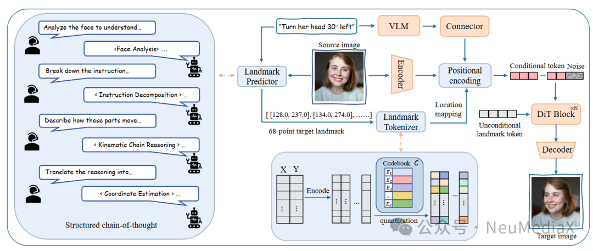
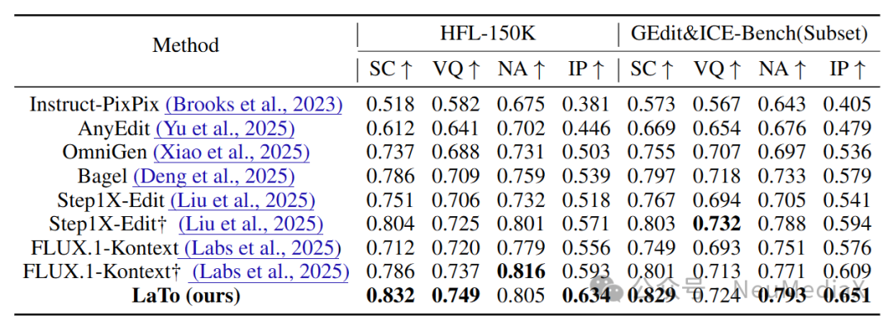
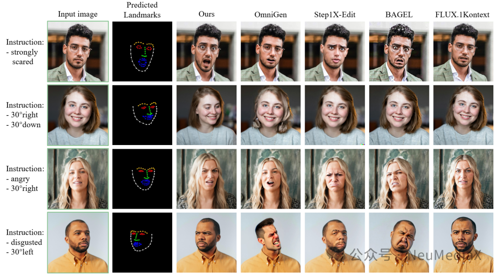
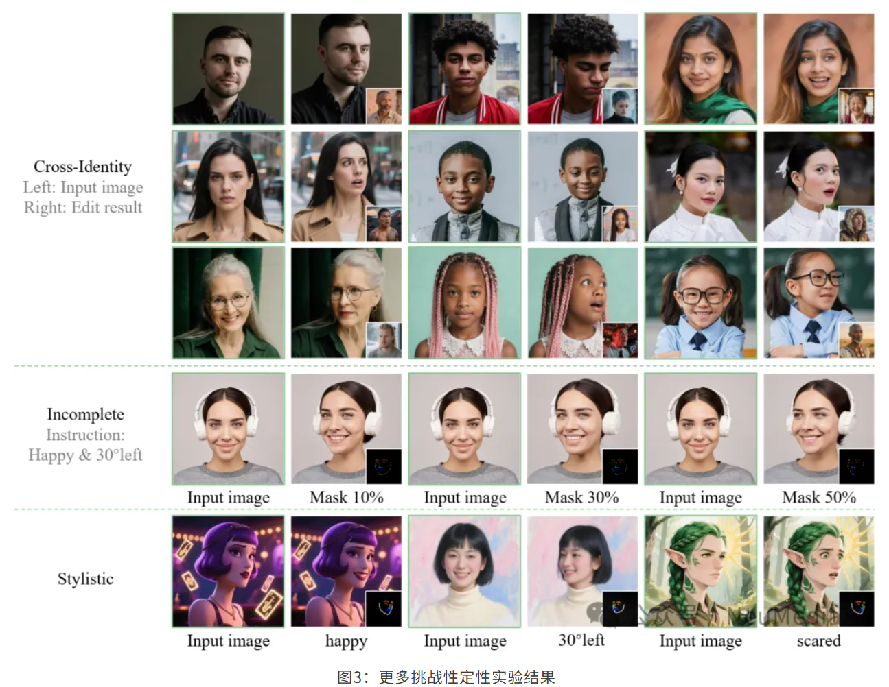

---
title: 2026 ICLR | LaTo：全新DiT架构实现精细化人像编辑
date: 2026-04-14
type: landing

sections:
  - block: contact
    content:

      text: |-
        # ICLR 2026 | LaTo：全新DiT架构实现精细化人像编辑

        最近用于指令驱动人脸编辑的多模态模型虽然实现了语义操控，但在精确的属性控制和身份（ID）保持方面仍然存在困难 。现有的方法通常将人脸关键点（Landmarks）作为刚性几何约束（例如渲染为2D图像），当目标关键点与源图像偏差较大（如夸张表情或大角度姿态变化）时，会导致严重的身份丢失 。为了解决这一局限性，我们提出了 LaTo，一种用于精细化、保持身份一致性的人脸编辑的关键点Token化扩散Transformer。LaTo 创新性地将原始关键点坐标直接量化为离散的面部Token，消除了对密集像素级对齐的需求 。结合位置映射编码和感知关键点的无分类器引导（CFG），LaTo 实现了指令、几何形态和外观特征之间的灵活解耦 。此外，我们还引入了基于视觉语言模型（VLM）的关键点预测器，利用思维链（CoT）从指令中推理目标关键点 。为了缓解数据稀缺问题，我们构建了 HFL-150K，这是目前该任务下规模最大的基准测试集，包含超过15万对带有精细指令的真实人脸图像对 。大量实验表明，LaTo 在身份保持（IP）上超越现有SOTA方法 7.8%，在语义一致性（SC）上超越 4.6% 。

        论文链接：https://arxiv.org/abs/2509.25731

        代码开源地址：https://github.com/MediaX-SJTU/landmark-tokenized-dit/

        ## 背景与现有挑战

        - **语义编码器的局限**：现有模型过度依赖高层语义编码器，难以捕捉实现精确空间控制所需的结构性面部线索。
        - **渲染2D关键点的“身份漂移”**：现有的DiT模型（如OmniGen、OminiControl）将关键点光栅化为2D图像进行编码。这种像素级的条件控制鼓励模型拟合固定的面部形状，当目标形状与源图像差异巨大时，极易产生伪影和身份丢失。
        - **计算与显存的双重焦虑**：在DiT架构中，自注意力机制的计算量随序列长度呈二次方增长。将长序列的密集视觉Token（2D关键点图像）追加到扩散Token中，会带来令人望而却步的内存和计算成本。

        
        
        ## 关键技术

        <figure style="text-align: center; margin: 1.5em 0;">
          
          <figcaption style="font-size: 0.8em; color: #666; margin-top: 0.5em;">
            图1：LaTo框架图解
          </figcaption>
        </figure>

        ### 关键点令牌化编码器（Landmark Tokenizer）

        将面部坐标转化为离散结构化令牌（Token），无缝融入 DiT 架构，在保留精确几何信息的同时，彻底解决人像编辑中的身份漂移与五官扭曲问题。

        ### 绝对空间映射式位置编码（Location-Mapped Conditioning）

        通过位置感知策略将令牌动态锚定至特征图物理区域，实现对表情、姿态的局部精确控制，消除区域错位或形变失真。

        ### 语义-几何协同预测模块（Landmark Predictor）

        集成轻量级视觉-语言模型（VLM），支持自然语言（如“向左转并微笑”）直接驱动，自动推断符合真实运动规律的目标关键点，准确解析“轻微”“大幅”等语义强度，使非专业用户也能实现可靠编辑。

        ## 实验结果

        如定量评估表所示，LaTo 在所有核心指标上均取得了显著领先 。特别是在极具挑战性的 身份保持（IP） 方面，LaTo 在 HFL-150K 测试集上以 0.634 的得分远超表现第二的 FLUX.1-Kontext (0.593)，相对提升高达 7.8% 。在语义一致性（SC）上，LaTo 同样超越了此前表现最优的 BAGEL 4.6% 。

        <figure style="text-align: center; margin: 1.5em 0;">
          
          <figcaption style="font-size: 0.8em; color: #666; margin-top: 0.5em;">
            表1：LaTo定量实验比较结果
          </figcaption>
        </figure>

        定性结果（图2）更是直观地表明，在面对剧烈的表情变化指令时，大多数基线模型都会出现类似卡通化或合成伪影的问题，而 LaTo 依然能保持卓越的照片级真实感和完美的人物ID一致性 。

        <figure style="text-align: center; margin: 1.5em 0;">
          
          <figcaption style="font-size: 0.8em; color: #666; margin-top: 0.5em;">
            图2：LaTo与当前Sota方法定性比较结果
          </figcaption>
        </figure>

        <figure style="text-align: center; margin: 1.5em 0;">
          
          <figcaption style="font-size: 0.8em; color: #666; margin-top: 0.5em;">
            图3：更多挑战性定性实验结果
          </figcaption>
        </figure>

        即便在面对极其恶劣的条件——例如使用其他人的关键点进行驱动（跨ID驱动）、丢失多达50%的关键点掩码，甚至是处理非写实风格的绘画图像时，LaTo 依然展现出了惊人的鲁棒性，能够有效保持基础的视觉质量和核心面部特征。

        ## 结论

        本文提出了一种基于关键点Token化的扩散Transformer模型——LaTo，专为精细化且保持身份一致性的人脸编辑而生 。通过创新性地将关键点坐标量化为离散Token，并辅以位置映射编码，LaTo 成功打破了几何约束与外观生成之间的死锁，彻底消除了传统像素级对齐带来的身份漂移痛点 。配合基于思维链的VLM关键点预测器和我们构建的15万规模高质量基准数据集 HFL-150K，LaTo 在实现顶级逼真度和语义一致性的同时，保证了极高的计算效率 。这项工作为未来以人为本的高质量、可控内容生成（如影视级后期、数字人动画生成等）奠定了坚实的技术基础。
---