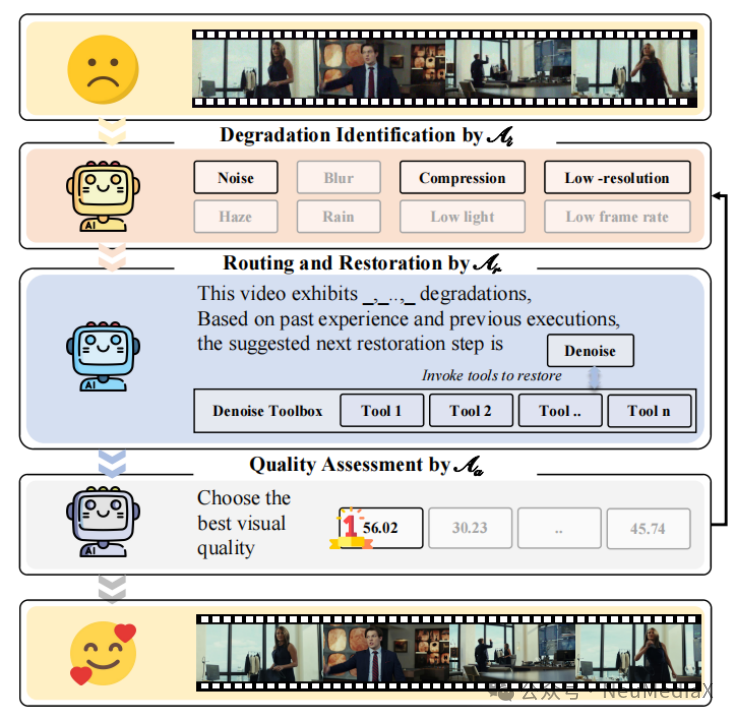
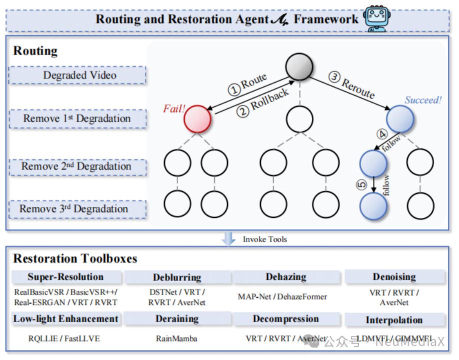
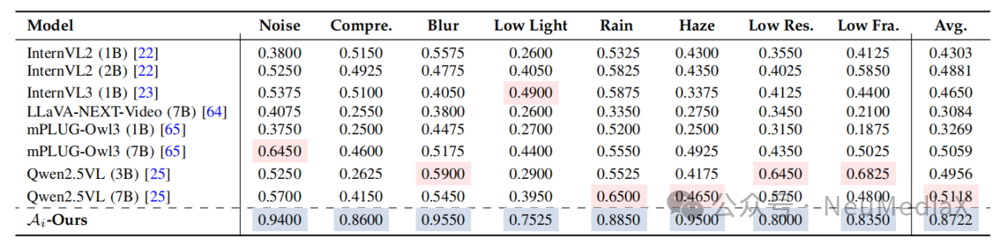

---
title: NeurlPS 2025 | 4DGCPro：面向渐进式体积视频流的高效分层4D高斯压缩技术
date: 2025-09-25
type: landing

sections:
  - block: contact
    content:

      text: |-
        # IEEE JSTSP | MoA-VR：基于多智能体协同的全能视频修复系统

        近年来，视频数据在娱乐、安防监控、自动驾驶等场景中被广泛应用，但真实世界中的视频往往不可避免地受到多种复杂退化的影响，例如噪声、压缩伪影、模糊、低光、低分辨率、低帧率以及雨雾等。这些退化不仅显著降低了视频的主观质量，也严重制约了下游高层视觉任务的性能。

        传统视频修复方法通常依赖人工经验选择特定模型，或采用固定的修复架构来处理所有退化类型。这类方法缺乏灵活性，难以应对真实场景中多种退化叠加的情况，同时对人工干预的依赖也限制了其扩展性与自动化程度。

        在前期工作中，我们系统性地研究了**生成与修复任务中的质量评价问题**，尤其关注如何在修复过程中对结果进行可量化、可解释的评估，并探索评价结果在系统决策中的作用：

        - **FineVQ (CVPR 2025)**：针对 UGC 视频的细粒度质量建模  
        - **F-bench (ICCV 2025)**：针对 AIGC 内容的多维度质量评价  

        基于这些探索，我们进一步提出：**能否以质量评价替代人工专家，并将其作为反馈信号直接驱动修复策略的选择？** 为此，我们引入多智能体思想，提出了一个全新的闭环视频修复框架——**MoA-VR（Mixture of Agents for Video Restoration）**。

        ---

        

        目前，该成果已被 **IEEE JSTSP** 正式接收。

        ---

        ## 方法设计

        MoA-VR 构建了一个“**评价–增强**”闭环修复系统，将质量评价体系嵌入修复工作流中，通过多个子智能体的协同，替代传统依赖人工的修复流程，实现自动化、可扩展的 all-in-one 视频修复。

        ### 三类核心智能体

        MoA-VR 系统由三个核心子智能体组成，分别负责 **退化识别、修复路径规划与执行、修复后质量评估**，共同构成一个完整的闭环系统。

        ---

        ### 退化识别智能体

        

        退化识别智能体的主要任务是对输入视频进行自动分析，识别其中存在的退化类型及其严重程度。视频退化形式多样，既包括噪声、压缩伪影、模糊、低分辨率等常见失真，也涵盖雨滴、雾霾等更复杂的真实场景退化。

        该模块的核心是一个具备多模态理解能力的大语言模型。我们将退化分析任务重新表述为文本分类问题：输入视频首先通过视觉编码器提取时空联合特征，随后映射至语言嵌入空间，由大模型输出清晰、可解释的退化描述。这种方式充分利用了语言模型的语义建模能力，并为后续修复模块提供了高层次、可解释的语义引导信息。

        ---

        ### 路由与修复智能体

        

        在退化类型明确之后，路由与修复智能体负责制定具体的修复路径，包括修复操作的先后顺序、所选用的修复模型，以及是否需要回滚或替换策略。真实视频中的退化往往是多种因素叠加的，例如“模糊 + 压缩”或“低光 + 噪声”，使得修复顺序与策略选择成为一个高度依赖上下文的决策问题。

        为此，我们设计了一个基于 **GPT-4** 的高层决策引擎，用于生成多种候选修复路径，例如“先去噪再去模糊”或“先增强亮度再恢复细节”。每一条路径都作为一次独立尝试。同时，引入自我探索与记忆机制：系统会记录不同修复路径的效果，当某一策略效果不佳时自动回滚，并避免在后续迭代中重复无效决策。具体修复操作通过调用工具箱中的专业修复模型完成。

        ---

        ### 修复后质量评估智能体

        

        不同修复工具在不同退化场景下的表现差异较大，传统方法往往依赖人工反复比较修复结果，效率低且难以规模化。为此，MoA-VR 设计了一个基于大语言模型的修复后质量评估智能体，用于自动评估并排序多个修复版本，从中选出最优结果。

        针对修复后视频质量分布与原始视频显著不同的问题，我们构建了一个专门面向修复任务的质量评估数据集 **ResVQ**。在模型设计上，融合视频视觉特征、修复语义信息与质量标签，通过指令微调的方式，引导模型对多个修复结果进行一致且可解释的质量打分。

        ---

        ## 多智能体闭环协作机制

        

        MoA-VR 的三类智能体构成了一个迭代式闭环系统，模拟人类专家进行视频修复时的决策流程：首先由退化识别智能体进行细粒度分析，其结果作为语义输入传递给路由与修复智能体；修复生成的多个候选结果再由质量评估智能体进行比较与筛选。质量评估结果会反向反馈，驱动系统在下一轮迭代中动态调整修复策略，直至获得最优结果。

        ---

        ## 实验结果

        我们从可视化效果与定量指标两个方面，对 MoA-VR 的性能进行了系统评估，并与当前主流的单帧图像修复方法、视频修复方法以及典型的 all-in-one 综合修复模型进行了全面对比。

        

        在同时存在多种退化的复杂场景中，传统方法往往只能缓解单一问题，修复结果容易出现伪影或细节缺失；而 MoA-VR 通过多智能体协同，能够精准识别并联合处理多种退化，生成结构更清晰、细节更丰富且主观观感更自然的结果。

        

        在“双退化”和“三退化”测试设定下，MoA-VR 在多个标准指标上均显著优于现有方法，整体达到或超过 SOTA 水平。这种优势主要源于其模块化、可扩展的设计，使系统能够根据具体退化动态选择并组合修复工具。

        ---

        ### 子智能体性能分析

        

        - **退化识别智能体**：在退化识别任务中平均准确率达到 **87%**，显著优于直接使用开源多模态大模型的结果。 

         
        - **路由与修复智能体**：相比随机路由、固定策略和直接推理等方案，在像素级与感知指标上均取得最优修复效果。  

        
        - **质量评估智能体**：在与人类主观评分的对比中，SRCC、PLCC、KRCC 均超过 **0.9**，RMSE 最低，显示出与人类感知高度一致的评估能力。

        ---

        ## 总结

        本文提出了 **MoA-VR**，一个由退化识别、修复路径规划与修复后质量评估三个智能体协同构成的多智能体视频修复系统。通过闭环协作机制，系统能够模拟人类专家的决策过程，在复杂混合退化场景下实现高效、鲁棒的视频修复。实验结果表明，MoA-VR 在客观指标和主观感知质量上均取得了显著提升，为自动化视频修复提供了一种新的范式。

---