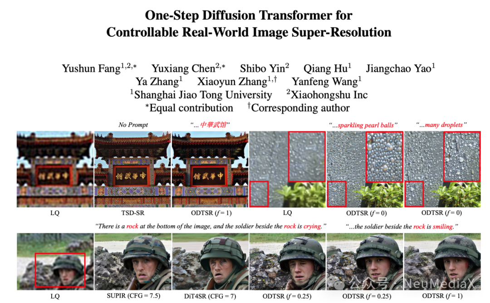
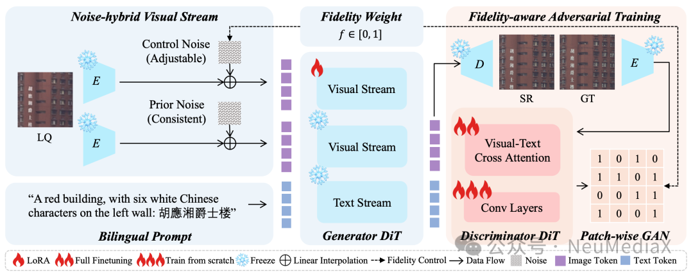
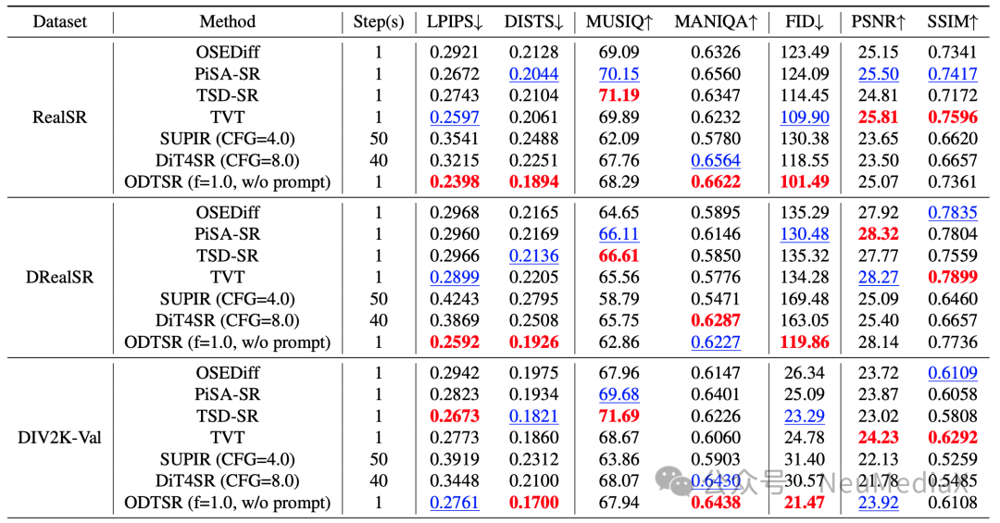
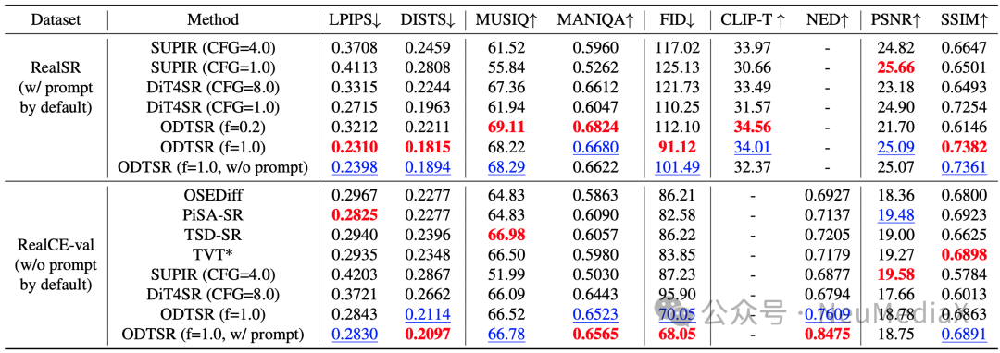
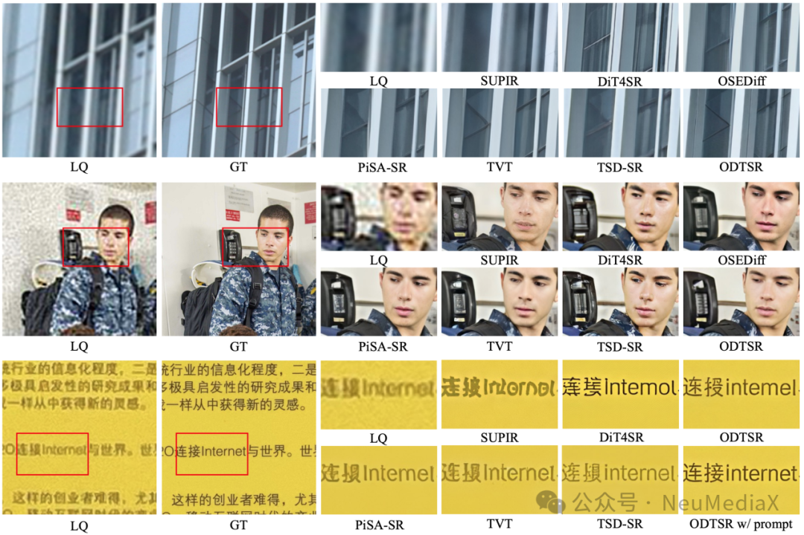
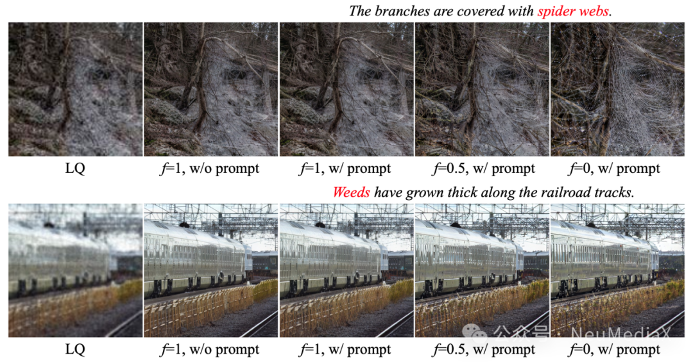

---
title: 2026 CVPR | ODTSR：基于20B大模型的单步可控真实世界图像超分辨率技术
date: 2026-03-30
type: landing

sections:
  - block: contact
    content:

      text: |-
        # CVPR 2026 | ODTSR：基于20B大模型的单步可控真实世界图像超分辨率技术

        近年来，真实世界图像超分辨率（Real-World Image Super-Resolution, Real-ISR）在图像修复、增强以及数字媒体处理等领域发挥着越来越重要的作用。然而，随着扩散模型（Diffusion Models）的引入，虽然生成图像的感知质量得到了显著提升，但现有方法在保真度（Fidelity）控制、多步迭代导致的推理速度缓慢以及生成结果的不确定性等方面仍面临显著挑战，难以满足实际应用中对高效性和可控性的需求。

        针对现有方法存在保真度与生成质量难以兼顾、多步推理成本高昂等问题，上海交通大学与小红书的研究团队联合提出了一种新的基于扩散 Transformer 的框架——ODTSR（One-Step Diffusion Transformer for Controllable Real-World Image Super-Resolution）。该工作首次将高达20B参数的生成模型（Qwen-Image）的强悍先验能力引入单步真实世界超分任务中，不仅实现了单步秒级生成，还能够通过提示词（Prompt）和保真度权重精准控制超分效果。

        
        

        论文链接：https://arxiv.org/abs/2511.17138

        代码开源地址：https://github.com/MediaX-SJTU/ODTSR

        ## 关键技术

        

        **图1：ODTSR框架图解**

        ODTSR 的核心目标是在实现极致单步推理速度的同时，保证高质量的生成效果与高度的灵活性。论文的关键技术主要有两点：

        ### 混合噪声视觉流（NVS，Noise-hybrid Visual Stream）

        模型在处理低质量图像时采用创新的双流结构。其中一条新引入的视觉流接收带有可调噪声（Control Noise）的低质量图像，另一条原始视觉流接收带有一致先验噪声（Prior Noise）的低质量图像。这一机制在有效提取低质量图像结构信息的同时，赋予了模型灵活调节细节强度的能力。

        ### 保真度感知对抗训练（FAA，Fidelity-aware Adversarial Training）

        针对将多步扩散过程压缩至单步时常见的画质衰减问题，研究团队引入了 FAA 技术。该训练策略不仅实现了真正的单步推理，还极大增强了生成过程的可控性。用户仅需调整一个保真度权重标量，即可在“高度忠实原图”与“极致细节生成”之间进行连续无缝调节。

      
        ## 实验结果

        作者在多个主流 Real-ISR 基准数据集上（RealSR、DRealSR、DIV2K、RealCE）进行了全面实验，对比了当前最先进的单步和多步超分方法。

        

        **图2：ODTSR与其他 SOTA 方法在标准图像超分任务上的量化对比**

        

        **图3：ODTSR与其他 SOTA 方法在标准图像超分任务上的量化对比**

        

        **图4：ODTSR 与其他 SOTA 方法的视觉效果与细节对比**

        

        **图5：ODTSR 的 Prompt 可控性展示**

        - **视觉效果**：ODTSR 在处理复杂真实世界退化图像时，能够生成更为细腻、逼真的纹理，且结构保真度显著高于传统的多步扩散模型。

        - **定量指标**：在多个主流感知质量基准测试中达到 SOTA（State-of-the-Art）水平，在保真度与画质指标之间取得了最优平衡。

        - **推理效率**：得益于单步扩散结构，ODTSR 大幅降低了引入 20B 参数基模的计算成本。

        - **零样本可控性**：在未针对特定场景文字数据集进行微调的情况下，ODTSR 在极具挑战性的真实场景中文文字超分任务中展现了惊艳的实力，通过简单的文本提示词，即可将模糊、残缺的中文文字精准还原。

        由此可见，ODTSR 同时实现了超高感知质量、极低的推理延迟以及强大的文本与保真度可控性，为真实世界图像超分任务树立了新的范式，也为百亿级参数视觉大模型在底层视觉（Low-level Vision）任务中的高效落地提供了重要参考。

---