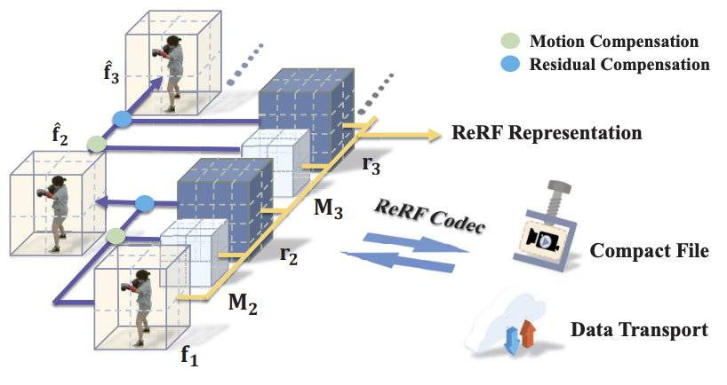
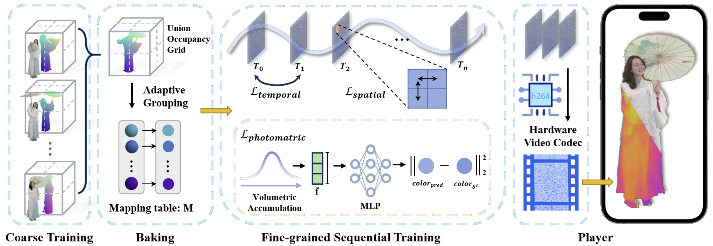
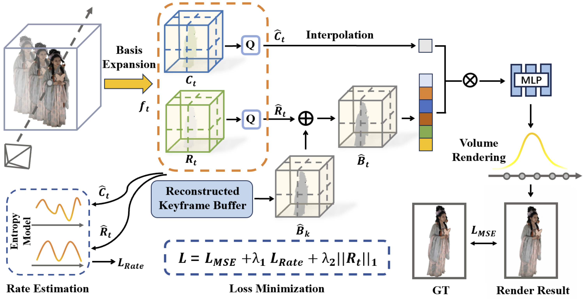
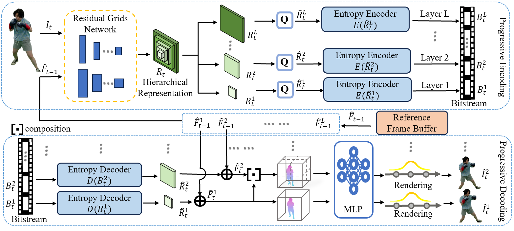
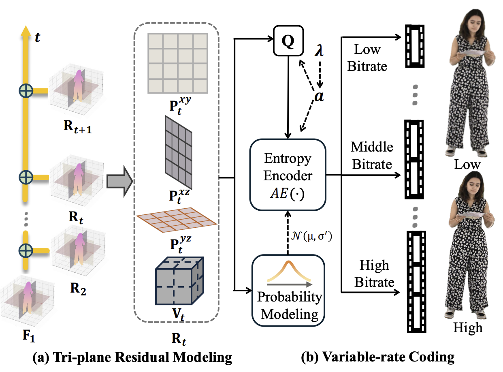
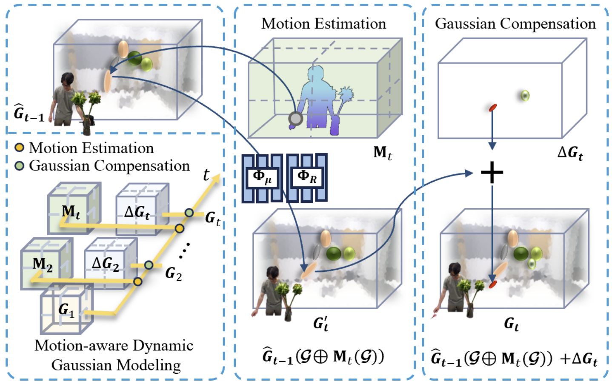

---
title: 迈向“视界”自由：一文看懂体积视频压缩技术的前沿浪潮
date: 2025-09-05
type: landing

sections:
  - block: contact
    content:

      text: |-
        <link rel="stylesheet" href="https://cdn.jsdelivr.net/npm/katex@0.16.4/dist/katex.min.css">
        <!-- 引入KaTeX渲染脚本 -->
        
        <!-- 引入自动渲染工具（可选，自动处理文档中的公式） -->
        

        

        # 迈向“视界”自由：一文看懂体积视频压缩技术的前沿浪潮

        还记得电影《黑客帝国》中尼奥躲避子弹的经典镜头吗？我们可以在任意时刻下，围绕主角进行360度任意视角的观看。这个被称为“自由视点视频”（Free-Viewpoint Video）的梦想，正在从科幻走进现实。它让我们不仅能“看”视频，更能“进入”视频，在三维场景中自由探索，时时刻刻体验VIP核心视角。然而，梦想的背后是巨大的技术挑战：一个体积视频文件的大小是普通视频的上百倍，直接传输会瞬间撑爆我们的网络，并且难以实现自然流畅的新视角渲染。如何将这个庞大的三维世界高质量的生成（Generation）、高效地“打包”（Compression）并流式传输（Streaming），就成了科学家和工程师们正在解决的核心难题。

        近年来，以神经辐射场（NeRF）和三维高斯溅射（3D Gaussian Splatting）为代表的新型表征技术，为这个问题带来了革命性的曙光。让我们沿着几篇关键的学术论文，一窥这条技术路线的演进。

        ## ReRF —— 迈出流式传输的第一步

        在深入探讨体积视频的流式传输之前，我们必须先了解其技术基石——**神经辐射场 (NeRF)**。这是一种革命性的技术，它使用一个神经网络来“记忆”一个完整的三维场景。通过查询空间中任意点的颜色和密度，NeRF能够从任何新颖的视点渲染出照片般逼真的图像，这在静态场景重建上取得了巨大成功。然而，将这一魔法应用于动态的视频序列却遇到了严峻的挑战。最直接的想法是为视频的每一帧都训练一个独立的NeRF模型，但这会导致灾难性的问题：不仅存储体积会变得天文数字般庞大，而且视频帧之间大量重复的静态背景信息也被反复学习，造成了巨大的冗余和浪费，渲染出的视频还可能因模型间的不一致而产生闪烁。

        面对这个困境，**ReRF( [Neural Residual Radiance Fields for Streamably Free-Viewpoint Videos](https://openaccess.thecvf.com/content/CVPR2023/papers/Wang\_Neural\_Residual\_Radiance\_Fields\_for\_Streamably\_Free-Viewpoint\_Videos\_CVPR\_2023\_paper.pdf) )** 带来了开创性的解法，它首次将经典的“残差”思想创造性地引入到动态神经场的表征中。ReRF的核心理念并非暴力地为每一帧建模，而是巧妙地将一个动态场景分解为一个高质量的**基础神经辐射场 (Base Field)** 和一系列轻量化的**残差神经辐射场 (Residual Field)**。此方法会分析当前帧与前一帧之间的运动，估算出一个精确的**稠密运动场 (Dense Motion Field)**。基于这个运动信息，系统可以将前一帧的特征“扭曲（Warping）”到当前时刻，从而生成一个对当前帧特征的精准预测。这个预测已经包含了绝大部分场景信息，而真正的“残差”，正是这个精准预测与真实情况之间的微小差异。由于运动预测相当准确，计算出的残差信息往往是高度稀疏的，仅在运动复杂、预测困难的区域才包含有效数值。

        

        这种“运动预测 + 残差修正”的范式使得服务器不再需要传输每一帧庞大的完整数据，而只需发送压缩后的紧凑运动信息和高度稀疏的残差流。客户端接收到这些轻量级数据后，便能在本地高效地重建出完整且连贯的动态场景。

        ## VideoRF —— 新型表征拥抱传统编码

        ReRF 以其开创性的残差结构，成功地将体积视频带入了“流媒体”时代。然而，它生成的残差流是一种全新的数据格式，我们的手机、电脑里并没有专门的硬件来高效地解压它，这限制了其在真实设备上的解码性能和普及潜力。面对这个问题，**VideoRF ([Rendering Dynamic Radiance Fields as 2D Feature Video Streams](https://arxiv.org/abs/2312.01407))** 提出了一个实用主义的解决方案：不另起炉灶，而是借力于已经存在于全球数十亿设备中、发展了几十年的成熟视频编解码技术。

        VideoRF 的核心思想，就是搭建一座桥梁，连接前沿的神经表征与经典的视频编码生态。它的目标是将动态场景中那些复杂、高维的神经特征，转化为一种传统视频编码器能够理解和处理的形态。这通过一个名为**“烘焙 (Baking)”**的关键步骤得以实现。此方法首先分析整个动态序列，确定动态物体所占据的三维空间范围。接着，它通过一种自适应的映射方式，创造性地将这些分布在三维空间中的动态神经特征，重新“铺平”和组织成一系列紧凑的二维平面。这一系列二维平面组合起来，就形成了一段看似抽象、色彩斑斓的**“2D特征视频 (2D Feature Video)”**。

        

        这个“特征视频”的每一帧，其“像素”存储的不再是传统的RGB颜色值，而是一个包含了三维场景几何与外观信息的神经特征向量。在训练阶段，VideoRF 不仅要确保这些特征能够通过一个小型神经网络（MLP）准确地渲染出最终图像（`L\_photometric`），还会通过时空正则化损失（`L\_temporal` 和 `L\_spatial`）来约束这个特征视频，使其在时间上和空间上都如真实视频般平滑、连贯。这种“可压缩性”导向的训练，使得特征视频本身就变得非常适合被压缩。

        至此，VideoRF 最具变革性的一步得以实现。这个经过精心设计的“特征视频”可以被直接送入任何标准的、拥有硬件加速的视频编解码器（Codec），例如我们日常使用的 H.264 或 H.265/HEVC。在终端设备上，播放器利用手机内置的硬件解码芯片，高效地解压码流，还原出特征视频，再通过轻量级的渲染网络实时合成自由视角的画面，向大规模的实际应用迈出了至关重要的一大步。

        ## JointRF —— “鱼”和“熊掌”亦可兼得的端到端联合优化

        VideoRF 的思路无疑是巧妙的，它成功地将前沿的神经隐式表征嫁接到成熟的视频编码硬件上，解决了体积视频辐射场压缩的有无问题。但这种“嫁接”也带来了一个内在的认知隔阂：负责场景表征的神经网络，在学习如何描绘三维世界时，对后续编码器的偏好一无所知；而传统的视频编码器，其设计初衷是为了压缩人眼可见的2D像素，对于如何高效压缩抽象、高维的神经特征，也并非它的专长。这个割裂的流程，就像一个翻译过程，信息在传递中难免会失真和效率折损。

        **JointRF ([End-to-End Joint Optimization for Dynamic Neural Radiance Field Representation and Compression](https://arxiv.org/abs/2405.14452))** 正是为了打破这堵墙而生。它提出了一个更根本的设想：“为什么不让场景表征和压缩这两个环节，从一开始就作为一个整体进行协同设计和训练？” 为此，JointRF构建了一个全新的、统一的端到端联合优化机制。在训练过程中，JointRF的目标函数是一个“三好学生”式的多任务目标，它要求模型同时做到：

        1. **渲染质量高 (Distortion Loss)**：渲染出的图像要和真实图像尽可能接近。
        2. **压缩码率低 (Rate Loss)**：用来表示场景的特征，必须是“天生易于压缩”的，即拥有很低的熵。
        3. **残差更稀疏 (Regularization)**：鼓励残差网格尽可能地“空”，只在必要的地方进行修正。

        

        为了实现第二点，JointRF引入了一个可微分的**熵模型**。这个熵模型就像一个“压缩成本估算器”，它可以在训练的每一步实时估算出当前的特征网格如果被压缩，大概会占用多少比特（码率）。这个估算出的码率成本会直接作为一项损失，反馈给整个网络。于是，场景表征网络在学习如何提升画质的同时，也被引导着寻找一种让熵模型“喜欢”的、更容易压缩的特征表达方式。

        在场景表征上，JointRF 继承并精炼了ReRF的残差思想，通过引入**辐射场函数分解 (function decomposition)** 的策略，进一步强化了特征的稀疏性，使其天然地更适合压缩。具体来说，它将每一帧的神经特征分解为两个核心部分：一个捕捉场景信号共性的**基础特征网格 (Basis Grid, B)** 和一个描绘空间细节变化的**系数特征网格 (Coefficient Grid, C)**。基于这套分解方法，JointRF将动态视频序列组织成高效的“帧组（Group of Frames, GOF）”进行处理。在每个帧组中，首个关键帧会用一个高质量、信息完备的特征对 {B1,C1} 来表示。而对于组内的后续帧，JointRF不再存储一个全新的基础网格，而是只学习一个极其紧凑的**残差网格 Rt**，用于补偿由运动带来的误差或新观察到的区域。当前帧的基础网格 Bt 通过简单的叠加残差修正来获得，同时模型会为这个更新过的基础网格 Bt 学习一个全新的、与之匹配的系数网格 Ct。

        最终，场景表征和熵压缩这两个模块在端到端的训练中协同优化，实现了“1+1 > 2”的效果。它在标准的率失真（Rate-Distortion）性能上远超前代方法，在同等码率下能提供显著更高的重建质量。更有趣的是，联合优化甚至能反过来提升渲染质量，因为模型学会了生成对压缩过程中的量化误差更具鲁棒性的特征。

        ## HPC & VRVVC —— 从分层到可变，在单一模型中解锁码率自由

        之前的方法，无论是VideoRF还是JointRF，都极大地提升了压缩效率。但它们通常是“固定码率”的，好比一辆只有“一个档位”的汽车。为了在不同的网络条件下（如5G和弱Wi-Fi）提供不同的画质，我们就必须为每个画质等级分别训练和存储一个独立的模型，这在实际应用中无疑是低效且昂贵的。真实世界的网络是波动的，用户设备性能也千差万别。我们真正需要的，是一个能够自适应调节码率的灵活框架。为此，我们的工作首先推出了**HPC**，它率先打破了“一个模型一个码率”的僵局；在此基础上，我们进一步思考并研发了**VRVVC**，实现了更高的码率自适应的灵活性。

        **HPC ([Hierarchical Progressive Coding Framework for Volumetric Video](https://arxiv.org/abs/2407.09026))** 借鉴了传统视频编码中的分层思想。其核心灵感源自传统视频编码中成熟的“可伸缩视频编码 (Scalable Video Coding, SVC)”思想，通过设计一种**分层 (Hierarchical)** 的神经特征表示来实现。这个结构就像一个千层蛋糕：**基础层 (Base Layer)**：分辨率最低，包含了场景最核心的结构和外观信息，仅用它便可渲染出基础画质的视频。**增强层 (Enhancement Layers)**：在此之上，HPC构建了多个分辨率递增的残差特征层，每一层都是对上一层的细节补充。这种设计的最大优势在于其**渐进式 (Progressive)** 的特性。当用户开始观看时，播放器可以先快速下载并解码基础层，迅速呈现画面。若网络条件允许，则继续下载增强层，画质便会“逐级”提升。这赋予了系统在几个预设“档位”间灵活切换的能力。为了让每个档位都达到最优性能，HPC还引入了一套**渐进式训练策略**，在训练时逐层优化，确保了每一层特征的表达和压缩都足够高效。

        

        尽管HPC通过分层结构实现了单一模型的多码率输出，但其码率调节的粒度受限于预设的物理层数，无法实现任意码率的灵活选择。为了克服这一限制，我们进一步提出了 **VRVVC ([Variable-Rate NeRF-Based Volumetric Video Compression](https://arxiv.org/abs/2412.11362))** ，旨在实现一种更精细、更灵活的可变码率压缩框架 

        VRVVC的核心创新，在于将码率调节的重心从分层表示转移到了压缩流程内部，具体而言，是设计了一套新颖的**可变码率熵编码方案**。此方案的关键是引入了两组紧密耦合的参数，并在端到端的训练中对其进行联合优化： 

        1. **预定义的拉格朗日乘子 $\Lambda=\{\lambda\_1, \dots, \lambda\_n\}$**：这组参数在训练中用于设定不同的码率-失真（Rate-Distortion）权衡目标。每一个$\lambda\_i$值都定义了一个特定的优化倾向，即在码率和失真之间如何取舍。
        2. **可学习的量化参数 $A=\{a\_1, \dots, a\_n\}$**：这组参数与$\Lambda$中的$\lambda\_i$一一对应，直接控制对神经特征进行量化时的步长。模型在训练过程中会学习到与每个$\lambda\_i$权衡目标相匹配的最优量化参数$a\_i$。 

        

        在训练阶段，VRVVC的单一模型会同时在一个包含多个码率-失真损失的函数下进行优化。这使得模型能够学习到一个从低码率到高码率的完整压缩策略空间，而不是针对单一码率进行优化。在推理（即播放）时，用户或应用程序只需选择一个目标$\lambda$值，框架便能调用与之对应的、已经学习好的量化参数$a$，从而生成精确匹配该码率目标的比特流。这种机制使得VRVVC能够用单一模型覆盖宽泛且连续的码率范围，实现了任意码率的灵活调整，为应对复杂多变的网络环境提供了更高的灵活性。

        ## 4DGC —— 模式迁移，四维高斯压缩的变与不变

        尽管基于NeRF的压缩方法已经演进得极为精妙，但它们始终受限于一个根本瓶颈：NeRF依赖于对神经网络进行成千上万次查询来渲染单个像素，这限制了其最终的渲染速度。2023年，**三维高斯泼溅 (3D Gaussian Splatting, 3DGS)** 的横空出世，为整个三维视觉领域带来了范式级的革命。它不再使用隐式的“场”来表达场景，而是用数以万计的、可显式定义的彩色半透明“三维高斯体”来直接“绘制”场景。这种显式表达带来了惊人的渲染速度和顶尖的画质，在静态场景上迅速超越了NeRF。

        这自然引出了一个核心问题：我们能否将从NeRF压缩技术演进中学到的宝贵经验，转换到3DGS这一更高效的新基座上？早期的一些动态3DGS方法，要么需要一次性加载整个序列而无法流式传输，要么简单地将场景表示和压缩作为独立步骤处理，忽视了在NeRF时代被反复验证的率失真权衡的重要性，导致压缩效率不佳。

        针对以上问题，我们提出**4DGC (Rate-Aware 4D Gaussian Compression for Efficient Streamable Free-Viewpoint Video)** 。它没有摒弃过去，而是站在巨人的肩膀上，继承了从JointRF到VRVVC等工作凝练出的核心——**对场景的表征和压缩进行端到端的联合优化**——并将其成功地应用于动态3DGS场景。

        4DGC的表征方式极其高效且专为流式传输设计。它采用了一种**运动感知的动态高斯建模**策略。具体来说：

        - 它不像早期方法那样为每一帧都存储一套全新的、庞大的高斯集合。而是以一个高质量的**关键帧**作为参考基准。
        - 对于后续的每一帧，4DGC的核心任务不再是重建，而是**预测运动**。它用一个极其紧凑的**多分辨率运动网格**来估计并编码前一帧中每个高斯体的刚性运动（平移和旋转）。
        - 当然，仅有运动预测是不够的。对于场景中新出现的物体或运动预测不准的区域，4DGC会智能地、稀疏地添加少量**补偿高斯**来进行精细修正。

        

        最终，一个复杂的动态场景就被分解成了一个初始高斯集，以及一连串轻量级的“运动指令”+“局部补丁”。这套表征被送入端到端压缩框架中。该框架同样采用可微分量化和隐式熵模型，在率失真损失的监督下，对运动网格和补偿高斯进行联合优化与高效编码。

        得益于3DGS本身的高效表征和先进的压缩策略，4DGC在重建质量与现有动态3DGS方法相当的情况下，实现了超过**16倍**的压缩率。更重要的是，相较于基于NeRF的SOTA方法，4DGC在训练速度、渲染速度（快了近百倍）、码率效率和最终渲染质量上实现了全面超越。

        ## 总结与展望

        回顾这条技术路线，我们看到一条清晰的脉络：

        **ReRF（实现流式） -> VideoRF（拥抱传统编码） -> JointRF（端到端联合优化） -> HPC/VRVVC（灵活可变码率） -> 4DGC（迁移到新型表征）**

        这一系列技术迭代的背后，是核心思想的演进：从追求功能上的“可用”，到注重体验上的“易用”；从表征与压缩的“分离式”设计，走向二者“一体化”的深度融合；从“固定”码率方案，发展到“灵活”的码率自适应。贯穿始终的主线，是**场景表示与数据压缩的协同设计与联合优化**，这已成为驱动该领域发展的核心方法论。

        这些技术的进步为一系列未来应用奠定了基础。随着体积视频压缩技术的成熟，在沉浸式体育直播、虚拟演唱会、AR/VR社交以及远程协作等场景中，用户将能体验到前所未有的自由度和真实感。随着研究的不断深入，一个支持高沉浸感、高交互性的三维视觉信息时代正在到来，而高效的体积视频表示与压缩，正是通往这个未来的关键技术基石。
---